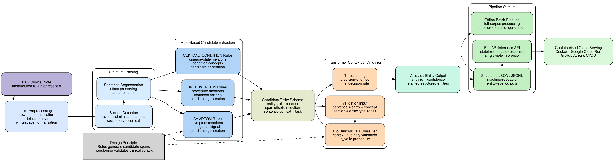
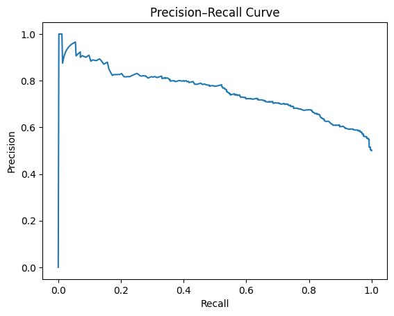
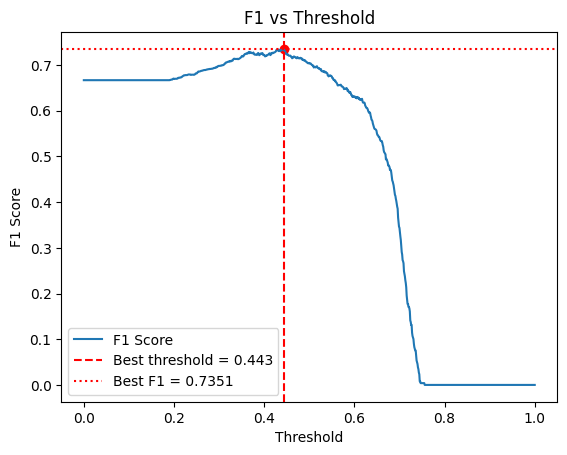
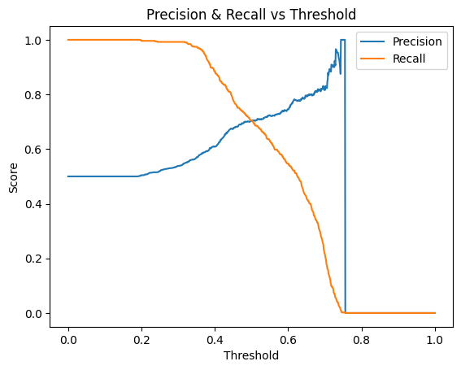
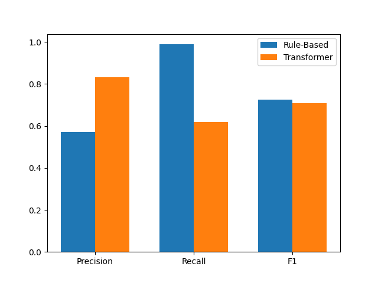
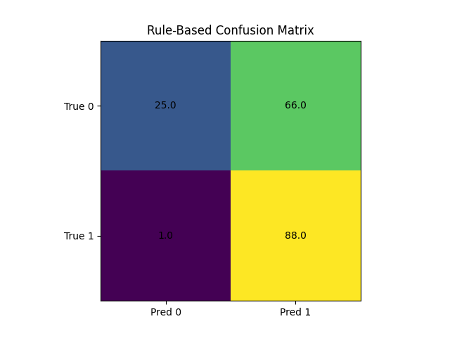
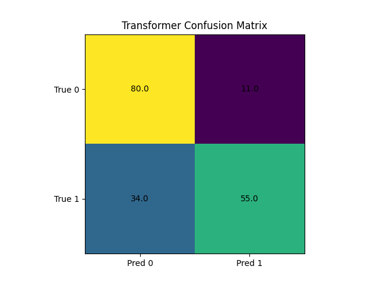

# Hybrid Clinical Notes Extraction Pipeline

***Precision-First Clinical NLP System Using Rule-Based Entity Extraction with BioClinicalBERT Validation for Structuring ICU Reports***

---

# Executive Summary

Cloud-deployed hybrid clinical NLP system for converting unstructured ICU progress notes into structured, auditable clinical entity outputs for downstream analysis and machine-learning workflows.

***Live API:*** https://clinical-nlp-api-1064509144938.europe-west1.run.app/docs

The pipeline uses a hybrid extraction-validation architecture. Deterministic, section-aware regex rules first extract span-aligned candidate entities from ICU notes across three clinically meaningful categories: `SYMPTOM`, `INTERVENTION`, and `CLINICAL_CONDITION`. This rule-based layer is designed to provide broad candidate coverage, schema control, and exact text provenance. 

A fine-tuned BioClinicalBERT classifier then validates each candidate in sentence context. This transformer layer handles contextual ambiguity such as intent, negation, temporality, and uncertainty. The model was fine-tuned using **1,200 manually annotated entity examples**, with threshold tuning used to prioritise precision for the final structured outputs.

The system was developed on a filtered PhysioNet MIMIC-IV ICU note corpus of **162,296 progress reports across 32,910 ICU stays**. Full-corpus execution generated **780,941 candidate entities**, of which **319,852** were classified as valid after transformer validation (**40.96% retained**).

Compared with the rule-based baseline, BioClinicalBERT validation substantially improved precision and reduced false positives on an evaluation set, while lowering recall due to stricter filtering. Precision increased from **0.571 to 0.833** (+45.9% relative improvement), and false positives decreased from **66 to 11** (-83.3%).

| System | Precision | Recall | F1-Score | False Positives | Interpretation |
|--------|----------:|-------:|---------:|----------------:|----------------|
| Rule-based baseline | 0.571 | **0.989** | **0.724** | 66 | Broad candidate generation with near-complete recall but high noise |
| BioClinicalBERT validation | **0.833** | 0.618 | 0.710 | **11** | Cleaner final outputs with substantially fewer false positives |
| Change | **+0.262** | -0.371 | -0.014 | **-55** | Precision improved substantially; recall loss reflects conservative filtering |

The final system supports both large-scale offline corpus processing and real-time inference through a stateless FastAPI service, containerised with Docker and deployed on Google Cloud Run. GitHub Actions CI/CD automates reproducible deployment updates. 

This work is research-focused and is not a live clinical decision-support system or regulatory-validated medical device.



_Figure: End-to-end hybrid extraction-validation architecture_

**Technical stack:** Python, PyTorch, HuggingFace Transformers, scikit-learn, pandas, FastAPI, Docker, Google Cloud Run, GitHub Actions

---

# Table of Contents

<details>
<summary>Expand table of contents</summary>

1. [Clinical Background & Motivation](#1-clinical-background--motivation)
   - [1.1 Clinical Data in EHR Systems](#11-clinical-data-in-ehr-systems)
   - [1.2 The Role of Clinical NLP](#12-the-role-of-clinical-nlp)
   - [1.3 Current System Paradigms in Clinical NLP](#13-current-system-paradigms-in-clinical-nlp)
   - [1.4 Design Motivation & Project Positioning](#14-design-motivation--project-positioning)
2. [Project Goals & Contributions](#2-project-goals--contributions)
   - [2.1 Primary Objectives](#21-primary-objectives)
   - [2.2 Key Technical Contributions](#22-key-technical-contributions)
3. [Pipeline Overview](#3-pipeline-overview)
   - [3.1 System Scope](#31-system-scope)
   - [3.2 End-to-End Pipeline](#32-end-to-end-pipeline)
   - [3.3 Hybrid Extraction-Validation Structure](#33-hybrid-extraction-validation-structure)
   - [3.4 Output Format](#34-output-format)
4. [Data Layer: Corpus Construction & Structural Validation](#4-data-layer-corpus-construction--structural-validation)
   - [4.1 Data Source: MIMIC-IV (v3.1)](#41-data-source-mimic-iv-v31)
   - [4.2 Pipeline Overview](#42-pipeline-overview)
   - [4.3 Cohort Definition & Filtering](#43-cohort-definition--filtering)
   - [4.4 Final Corpus Output](#44-final-corpus-output)
   - [4.5 Structural Profiling (Feasibility Validation)](#45-structural-profiling-feasibility-validation)
5. [Preprocessing Layer](#5-preprocessing-layer)
   - [5.1 Preprocessing Overview](#51-preprocessing-overview)
   - [5.2 Implementation](#52-implementation)
   - [5.3 Design Rationale](#53-design-rationale)
6. [Structural Parsing Layer](#6-structural-parsing-layer)
   - [6.1 Section Detection & Extraction](#61-section-detection--extraction)
   - [6.2 Sentence Segmentation](#62-sentence-segmentation)
7. [Entity Schema Design](#7-entity-schema-design)
   - [7.1 Entity Schema Overview](#71-entity-schema-overview)
   - [7.2 Entity Scope](#72-entity-scope)
   - [7.3 Entity Boundary Definitions](#73-entity-boundary-definitions)
   - [7.4 Excluded Entity Types](#74-excluded-entity-types)
   - [7.5 JSON Output Schema](#75-json-output-schema)
   - [7.6 Schema Design Decisions](#76-schema-design-decisions)
8. [Rule-Based Extraction Layer](#8-rule-based-extraction-layer)
   - [8.1 Extraction Overview](#81-extraction-overview)
   - [8.2 Negation Handling](#82-negation-handling)
   - [8.3 Symptom Extraction](#83-symptom-extraction)
   - [8.4 Intervention Extraction](#84-intervention-extraction)
   - [8.5 Clinical Condition Extraction](#85-clinical-condition-extraction)
   - [8.6 Integrated Extraction Pipeline](#86-integrated-extraction-pipeline)
9. [ML Modelling Strategy](#9-ml-modelling-strategy)
   - [9.1 Validation Task Formulation](#91-validation-task-formulation)
   - [9.2 Why Validation Is Seperate From Extraction](#92-why-validation-is-seperate-from-extraction)
   - [9.3 Why Not End-to-End Model Extraction](#93-why-not-end-to-end-model-extraction)
   - [9.4 Model Classes Considered](#94-model-classes-considered)
   - [9.5 Why Transformer Encoders](#95-why-transformer-encoders)
   - [9.6 Encoder-Based Models vs Generative LLMs](#96-encoder-based-models-vs-generative-llms)
   - [9.7 Why Fine-Tuning Rather than Training from Scratch](#97-why-fine-tuning-rather-than-training-from-scratch)
   - [9.8 Candidate Encoder Models & Domain Alignment](#98-candidate-encoder-models--domain-alignment)
   - [9.9 Final Model Choice: BioClinicalBERT](#99-final-model-choice-bioclinicalbert)
10. [Transformer-Based Validation Layer](#10-transformer-based-validation-layer)
    - [10.1 Validation Overview](#101-validation-overview)
    - [10.2 Annotation Dataset Construction](#102-annotation-dataset-construction)
    - [10.3 Manual Annotation Framework](#103-manual-annotation-framework)
    - [10.4 Dataset Splitting Strategy](#104-dataset-splitting-strategy)
    - [10.5 Fine-Tuning Setup](#105-fine-tuning-setup)
    - [10.6 Cross-Validation & Model Selection](#106-cross-validation--model-selection)
    - [10.7 Threshold Optimisation Using Out-of-Fold Predictions](#107-threshold-optimisation-using-out-of-fold-predictions)
    - [10.8 Final Model Training & Artifact Saving](#108-final-model-training--artifact-saving)
    - [10.9 Development Refinement](#109-development-refinement)
11. [Evaluation](#11-evaluation)
    - [11.1 Evaluation Objective](#111-evaluation-objective)
    - [11.2 Evaluation Design](#112-evaluation-design)
    - [11.3 Two-Layer Evaluation Structure](#113-two-layer-evaluation-structure)
    - [11.4 Evaluation Prediction Dataset](#114-evaluation-prediction-dataset)
    - [11.5 Metric Selection & Rationale](#115-metric-selection--rationale)
    - [11.6 Confusion Matrix Rationale](#116-confusion-matrix-rationale)
    - [11.7 Evaluation Implementation](#117-evaluation-implementation)
    - [11.8 Core System Evaluation](#118-core-system-evaluation)
    - [11.9 Stratified & Diagnostic Evaluation](#119-stratified--diagnostic-evaluation)
    - [11.10 Overall Evaluation Summary](#1110-overall-evaluation-summary)
12. [End-to-End Inference Pipeline](#12-end-to-end-inference-pipeline)
    - [12.1 Purpose & Scope](#121-purpose--scope)
    - [12.2 Unified Pipeline Architecture](#122-unified-pipeline-architecture)
    - [12.3 Extraction Component](#123-extraction-component)
    - [12.4 Validation Component](#124-validation-component)
    - [12.5 Pipeline Orchestration](#125-pipeline-orchestration)
    - [12.6 Output Schema](#126-output-schema)
    - [12.7 Dataset Strategy](#127-dataset-strategy)
13. [Full-Corpus Dataset Generation](#13-full-corpus-dataset-generation)
    - [13.1 Full-Corpus Pipeline Execution](#131-full-corpus-pipeline-execution)
    - [13.2 Corpus Coverage and Dataset Scale](#132-corpus-coverage-and-dataset-scale)
    - [13.3 Entity Type Distribution & Validation Rates](#133-entity-type-distribution--validation-rates)
14. [Deployment](#14-deployment)
    - [14.1 Deployment Overview](#141-deployment-overview)
    - [14.2 API Serving Layer](#142-api-serving-layer)
    - [14.3 Runtime Architecture](#143-runtime-architecture)
    - [14.4 Containerisation & Cloud Hosting](#144-containerisation--cloud-hosting)
    - [14.5 CI/CD Automation](#145-cicd-automation)
    - [14.6 Deployment Components](#146-deployment-components)
    - [14.7 Deployment Artifacts](#147-deployment-artifacts)
15. [API Usage Guide](#15-api-usage-guide)
    - [15.1 Endpoint & Input](#151-endpoint--input)
    - [15.2 Example Usage](#152-example-usage)
16. [Methodological Rationale & Design Reflection](#16-methodological-rationale--design-reflection)
    - [16.1 Purpose of the Hybrid Design](#161-purpose-of-the-hybrid-design)
    - [16.2 Key Design Constraints & Trade-offs](#162-key-design-constraints--trade-offs)
    - [16.3 Why Precision Was Prioritised](#163-why-precision-was-prioritised)
    - [16.4 Consequences for System Performance](#164-consequences-for-system-performance)
    - [16.5 Core Insights & Practical Implications](#165-core-insights--practical-implications)
17. [Limitations](#17-limitations)
    - [17.1 Overview](#171-overview)
    - [17.2 Data & Generalisability](#172-data--generalisability)
    - [17.3 Extraction & Validation Limitations](#173-extraction--validation-limitations)
    - [17.4 Evaluation Limitations](#174-evaluation-limitations)
    - [17.5 Scope & Output Limitations](#175-scope--output-limitations)
    - [17.6 Deployment & Clinical Integration Limitations](#176-deployment--clinical-integration-limitations)
18. [Future Work](#18-future-work)
    - [18.1 Overview & Rationale](#181-overview--rationale)
    - [18.2 Validation & Model Improvements](#182-validation--model-improvements)
    - [18.3 Annotation & Evaluation Enhancements](#183-annotation--evaluation-enhancements)
    - [18.4 Schema, Context, & Downstream Modelling](#184-schema-context--downstream-modelling)
    - [18.5 Deployment & MLOps Extensions](#185-deployment--mlops-extensions)
19. [Potential Clinical & Research Integration](#19-potential-clinical--research-integration)
    - [19.1 Downstream Use Cases](#191-downstream-use-cases)
    - [19.2 Integration With Downstream Modelling](#192-integration-with-downstream-modelling)
    - [19.3 Practical Integration Pathway](#193-practical-integration-pathway)
20. [Repository Structure](#20-repository-structure)
21. [Local Setup & Reproduction](#21-local-setup--reproduction)
    - [21.1 Run the API Locally](#211-run-the-api-locally)
    - [21.2 Full Pipeline Reproduction](#212-full-pipeline-reproduction)
22. [Requirements & Dependencies](#22-requirements--dependencies)
23. [License](#23-license)
24. [Copyright](#24-copyright)
25. [Citation](#25-citation)
26. [Acknowledgements](#26-acknowledgements)

</details>

---

# 1. Clinical Background & Motivation

## 1.1 Clinical Data in EHR Systems

Modern Electronic Health Record (EHR) systems store patient information across two primary data modalities:

| Modality | Characteristics | Examples | Usability |
|----------|----------------|----------|-----------|
| **Structured data** | Standardised format, controlled vocabularies, consistent schema | Vital signs, laboratory results, medication records, diagnosis codes | Stored in tabular or time-series formats; directly queryable and readily usable in statistical analysis and machine learning |
| **Unstructured data** | Free-text, variable structure, context-dependent language | Progress notes, admission notes, discharge summaries, radiology reports | Rich in clinical detail but not directly machine-readable or easily usable for computational analysis |

Unstructured clinical text captures aspects of patient care that are not fully represented in structured fields, including:

- Symptom descriptions, including onset, severity, and progression  
- Clinical reasoning, including differential diagnoses, impressions, and plans  
- Negation, uncertainty, and ruled-out diagnoses  
- Temporal narratives, including history, progression, and response to treatment  
- Contextual factors, including social history, functional status, and baseline state  

However, this information presents significant challenges:

- Lack of standardisation across clinicians, institutions, and time  
- High variability in terminology, abbreviations, and phrasing  
- Strong dependence on context for correct interpretation  
- Difficulty querying, aggregating, or converting into machine-learning features at scale  

As a result, unstructured clinical text contains substantial clinical signal but cannot be directly operationalised for computational use without transformation.

This creates a fundamental disconnect between **data availability** and **data usability**, motivating structured clinical NLP approaches.

##
## 1.2 The Role of Clinical NLP

Clinical natural language processing (NLP) addresses this gap by transforming free-text medical data into structured, machine-readable representations.

In practice, clinical NLP systems may extract:

- Named entities, such as symptoms, diagnoses, medications, procedures, or interventions  
- Attributes, such as negation, temporality, certainty, severity, and status  
- Relationships between clinical concepts  

These outputs can be normalised into structured schemas, enabling integration into downstream workflows such as:

- Cohort identification  
- Clinical audit and population-level analysis  
- Feature generation for predictive modelling  
- Clinical decision support and information retrieval  

This transformation allows narrative clinical data to be queried, aggregated, validated, and integrated into computational clinical systems.

##
## 1.3 Current System Paradigms in Clinical NLP

Clinical NLP systems can be implemented using several methodological paradigms. In practice, systems often combine multiple approaches depending on the task, data availability, annotation burden, and required level of auditability.

| Paradigm | Typical Use | Strengths | Limitations |
|----------|-------------|-----------|-------------|
| **Rule-based systems** | Pattern matching, section parsing, negation rules, dictionary-based extraction | Deterministic, interpretable, auditable, strong for well-defined patterns | Limited linguistic coverage; requires manual engineering |
| **Classical ML / sequence models** | CRF-based NER, feature-engineered classifiers | Historically important for token-level extraction and structured prediction | Requires engineered features; less competitive than transformers for many contextual tasks |
| **Transformer-based models** | NER, classification, attribute detection, contextual validation | Strong contextual representations; effective for negation, temporality, and ambiguity | Requires labelled data; probabilistic outputs require evaluation and thresholding |
| **Generative LLMs** | Summarisation, question answering, report generation, prompt-based extraction | Flexible, expressive, useful for generative and reasoning-heavy workflows | Requires additional controls for schema consistency, reproducibility, output validation, and cost management |

For structured clinical extraction, there is no single universally optimal architecture. The appropriate design depends on whether the priority is span traceability, recall, precision, interpretability, scalability, or flexible language understanding.

This project adopts a hybrid design because it requires:

- Deterministic span extraction  
- Fixed schema-controlled outputs  
- Sentence-level contextual validation  
- Reproducible and auditable behaviour  
- Efficient use of a limited manually annotated dataset  

##
## 1.4 Design Motivation & Project Positioning

### Design Constraints

Clinical NLP system design is shaped by practical constraints:

- **Limited labelled data:** high-quality annotation requires clinical understanding and is expensive to scale  
- **High precision requirements:** false positives can corrupt downstream features, cohorts, or analyses  
- **Need for interpretability and auditability:** outputs should be inspectable and traceable to source text  
- **Reproducibility:** behaviour should remain stable across runs and environments  
- **Context dependence:** clinical validity often depends on negation, temporality, intent, uncertainty, and section context  

These constraints do not make supervised NER or end-to-end extraction invalid in general. Rather, they shape the design choice for this project: a controlled hybrid pipeline is more appropriate than unconstrained model-based extraction or purely generative extraction.

##
### Architectural Implications

The system therefore separates extraction from validation:

| Component | Role |
|----------|------|
| **Rule-based extraction** | Generates deterministic, span-aligned candidate entities within a fixed schema |
| **Transformer validation** | Classifies whether each candidate is clinically valid in sentence context |

This creates a two-stage pipeline:

> High-recall candidate generation → precision-oriented contextual validation

This architecture allows the system to preserve exact span provenance while using machine learning only where contextual interpretation is required.

Accordingly, the project prioritises:

- Pipeline-centric design over model-centric optimisation
- Clear separation between candidate extraction and contextual validation
- Structured outputs suitable for downstream modelling
- Controlled use of learned models as validation components
- Reproducible and auditable system behaviour 

##
### Broader Positioning of This Work

Within a broader clinical data pipeline, this work addresses the transformation from unstructured narrative data into structured features.

It complements prior work on structured physiological modelling by representing an earlier stage in the clinical data processing workflow and by operating on a different data modality:

- Unstructured text → structured feature extraction (this NLP project)
- Structured physiological data → predictive modelling ([Time-Series ICU Deterioration Predictor](https://github.com/SimonYip22/time-series-icu-deterioration-predictor))  

Together, these projects represent connected but distinct components of a clinical data system: extracting structured signal from narrative documentation, then using structured data for downstream modelling.

---

# 2. Project Goals & Contributions

## 2.1 Primary Objectives

1. Develop a clinically grounded NLP pipeline to transform unstructured ICU clinical notes into structured, machine-readable representations suitable for downstream analysis and modelling.
2. Design a hybrid extraction framework that combines deterministic rule-based methods with transformer-based validation to balance recall and precision.
3. Implement section-aware extraction to capture clinically meaningful entities (symptoms, interventions, clinical conditions) from heterogeneous clinical narratives.
4. Produce precision-oriented structured outputs by incorporating contextual validation and classification mechanisms suitable for downstream use.
5. Evaluate pipeline performance against a manually annotated ground truth dataset to assess extraction accuracy and validation effectiveness.
6. Generate a schema-aligned structured dataset from the full corpus of clinical notes, demonstrating scalability beyond single-note inference.
7. Develop an end-to-end inference system that transitions the pipeline from local experimentation to a reproducible, cloud-hosted API.

##
## 2.2 Key Technical Contributions

- **ICU Corpus Generation:** Constructed a filtered corpus of adult ICU progress notes (≥24-hour stay, within 24 hours of admission), enabling consistent and clinically relevant input data for pipeline development.

- **Clinical Text Processing Pipeline:** Implemented preprocessing including text normalisation, section header detection, sentence segmentation, and tokenisation to support structured downstream extraction.

- **Deterministic Entity Extraction System:** Designed a rule-based extraction framework targeting three clinically relevant entity types, incorporating regex-based patterns, section-aware logic, and negation handling to ensure high-recall candidate generation with controlled precision.

- **Hybrid Pipeline Architecture:** Developed a modular system separating candidate generation (rule-based extraction) and contextual validation (transformer-based classification), enforcing controlled interaction between deterministic and probabilistic components.

- **Transformer-Based Validation Layer:** Fine-tuned a domain-specific transformer model (BioClinicalBERT) on 1000+ manually annotated samples for sentence-level classification, enabling filtering of false positives and improving overall precision.

- **Precision-Oriented Threshold Tuning:** Implemented threshold optimisation using out-of-fold (OOF) predictions to calibrate the transformer validation layer, enabling controlled trade-offs between precision and recall and aligning model behaviour with the pipeline’s precision-first design objective.

- **Structured Output Schema Design:** Defined a consistent JSON schema capturing entity spans, entity types, section context, negation status, and validation outputs (classification and confidence scores), ensuring compatibility with downstream ML pipelines.

- **Evaluation Framework:** Evaluated extraction and validation components against a manually annotated ground truth dataset using precision, recall, F1-score, and confusion matrices to quantify performance and validate expected behaviour.

- **Full-Corpus Execution Pipeline:** Executed the complete pipeline across the full dataset to generate large-scale structured outputs, demonstrating system scalability and robustness.

- **Deployment Inference System:** Built and deployed a production-style API using FastAPI (serving layer), Uvicorn (ASGI server), Docker (containerisation), and Cloud Run (serverless hosting) to enable real-time inference.

- **CI/CD Automation Pipeline:** Implemented GitHub Actions–based deployment integrating Git LFS model handling, Cloud Build image creation, and automated Cloud Run deployment, ensuring reproducible and version-controlled updates.

---

# 3. Pipeline Overview

## 3.1 System Scope

The pipeline converts raw ICU clinical notes into structured, entity-level JSON outputs.

It uses a hybrid extraction-validation design: deterministic rules identify candidate entity spans, and a fine-tuned BioClinicalBERT classifier validates whether each candidate is clinically valid in sentence context.

The transformer layer does not perform span extraction. It only validates candidates generated by the rule-based extraction layer.


##
## 3.2 End-to-End Pipeline

```text
          Raw ICU clinical note
                   │
           Text preprocessing
                   │
           Structural parsing
(Section detection + sentence segmentation)
                   │
     Rule-based candidate extraction
                   │
  BioClinicalBERT contextual validation
                   │
                   ▼
      Structured JSON entity output
```

Each stage has a distinct responsibility:

| Stage | Purpose | Output |
|-------|---------|--------|
| Text preprocessing | Normalises note text while preserving clinical meaning and document structure | Cleaned clinical note text |
| Section detection | Identifies clinically meaningful note sections such as assessment, plan, HPI, and physical examination | Section-level text blocks |
| Sentence segmentation | Splits section text into sentence-level units with character offsets | Sentence objects with local context |
| Rule-based candidate extraction | Identifies candidate symptoms, interventions, and clinical conditions using deterministic extraction rules | Span-aligned candidate entities |
| Transformer validation | Classifies whether each candidate entity is clinically valid in context | Validated entity outputs with confidence scores |
| JSON serialisation | Converts validated entities into a consistent structured schema | Machine-readable entity-level JSON |

##
## 3.3 Hybrid Extraction-Validation Structure

The pipeline separates extraction from validation.

| Component | Role | Output |
|-----------|------|--------|
| Rule-based extraction | Defines the extraction space by identifying candidate entity spans deterministically | Candidate entities with provenance |
| BioClinicalBERT validation | Defines the validation decision by classifying whether candidates are valid in sentence context | Validated entities with confidence scores |

This separation preserves deterministic span provenance while using the transformer only for contextual interpretation.

The three extracted entity types are:

| Entity Type | Validation Task |
|------------|-----------------|
| `SYMPTOM`    | Determine whether the symptom is present rather than negated, historical, or absent |
| `INTERVENTION` | Determine whether the intervention was performed rather than planned, suggested, or hypothetical |
| `CLINICAL_CONDITION` | Determine whether the condition is active rather than historical, resolved, uncertain, or ruled out |

##
## 3.4 Output Format

The final output is one JSON object per extracted entity, where each entity record includes:

- Source identifiers linking the entity to the note, hospital admission, and ICU stay
- Extracted entity text and normalised concept
- Entity type
- Character-level span offsets
- Sentence and section context
- Rule-derived negation status where applicable
- Transformer validation result
- Confidence score

Example output structure:

```json
{
  "note_id": "string",
  "subject_id": "string",
  "hadm_id": "string",
  "icustay_id": "string",
  "entity_text": "string",
  "concept": "string",
  "entity_type": "SYMPTOM | INTERVENTION | CLINICAL_CONDITION",
  "char_start": 0,
  "char_end": 0,
  "sentence_text": "string",
  "section": "string",
  "negated": true | false | null,
  "validation": {
    "is_valid": true | false,
    "confidence": 0.0,
    "task": "symptom_presence | intervention_performed | clinical_condition_active"
  }
}
```

The schema preserves both extraction provenance and validation outputs, allowing each entity to be inspected, audited, filtered, or used as a downstream machine-learning feature.

---

# 4. Data Layer: Corpus Construction & Structural Validation

## 4.1 Data Source: MIMIC-IV (v3.1)

- **Overview:** Medical Information Mart for Intensive Care (MIMIC)-IV database is comprised of deidentified patient electronic health records, taken from PhysioNet.org.
- **Contents:** structured data and free-text clinical notes split into `hosp` module (hospital admissions data) and `icu` module (ICU admissions data)
- **Patients:** `icu` module contains 65,366 unique patients over 94,458 ICU stays
- **Datasets used:** `ICUSTAYS.csv`, `NOTEEVENTS.csv`, `PATIENTS.csv`

##
## 4.2 Pipeline Overview 

Constructed a filtered ICU clinical note corpus using deterministic filtering logic suitable for downstream NLP extraction.

```text
                 Raw MIMIC-IV Data
         (PATIENTS, ICUSTAYS, NOTEEVENTS)
                        │
                  NOTEEVENTS.csv 
         (2,083,180 reports, 61,532 stays)
                        │
                 build_corpus.py
    (Filtering logic using ICUSTAYS and PATIENTS)
                        │
                        ▼
                 icu_corpus.csv 
        (162,296 reports, 32,910 ICU stays)
```

##
## 4.3 Cohort Definition & Filtering

### Data Sources and Columns

| Data Source | Key Columns |
------------| ------------
| `PATIENTS` | `SUBJECT_ID`, `DOB`, `GENDER` |
| `ICUSTAYS` | `SUBJECT_ID`, `HADM_ID`, `ICUSTAY_ID`, `FIRST_CAREUNIT`, `INTIME`, `OUTTIME` |
| `NOTEEVENTS` | `SUBJECT_ID`, `HADM_ID`, `CHARTTIME`, `CATEGORY`, `ISERROR`, `TEXT` |

##
### Rule-Based Filtering Logic

Cohort Enforcement:

- ICU stay (`ICUSTAY_ID`) is used as the cohort anchor. 
- Notes are linked to valid ICU stays via `SUBJECT_ID` + `HADM_ID`.

Population Constraints:

- **Adult patients:** `AGE ≥ 18`
- **ICU types:** `MICU`, `SICU`, `CCU`, `TSICU`, `CSRU`
- **Minimum ICU stay:** `≥ 24 hours`

Note Selection:

- **Included categories:** physician, nursing, nursing/other
- **Excluded:** Radiology, ECG, discharge summaries, administrative notes

Temporal Filtering:

- Notes restricted to `INTIME ≤ CHARTTIME ≤ INTIME + 24h`
- **Early window:** within 24 hours post-ICU admission
- Ensures early ICU documentation relevant to acute clinical state.

Data Quality Filtering:

- Excluded rows where `ISERROR` = 1
- Removed notes with explicit error flags to ensure data integrity

##
## 4.4 Final Corpus Output

Filtered corpus contains:

- **Total notes:** 162,296
- **ICU stays:** 32,910
- **Mean notes per stay:** ~4.9
- ~72.7% of adult ICU stays contain ≥1 early qualifying note

Each row represents a single clinical note with 10 columns:

- **Patient identifiers:** `SUBJECT_ID`, `HADM_ID`, `ICUSTAY_ID`
- **Demographics:** `AGE`, `GENDER`
- **ICU metadata:** `FIRST_CAREUNIT`, `LOS_HOURS`, `CATEGORY`
- **Timestamp:** `CHARTTIME`
- **Raw clinical text:** `TEXT`

Saved to `data/processed/icu_corpus.csv` for downstream NLP processing.

##
## 4.5 Structural Profiling (Feasibility Validation)

A combination of manual inspection (n=30) and quantitative sampling (n=500), including extreme boundary inspection (n=45) was performed to verify that the corpus supports deterministic NLP extraction:

- Notes exhibit consistent section-based structure (e.g. colon headers, system-based sections)
- Numeric clinical data (e.g. vitals, labs) is highly prevalent
- Artefacts follow predictable patterns ( e.g. `[** ... **]` de-identification markers, EMR artifacts, Javascript/link fragments)
- Structural variability exists but remains bounded

These findings provided positive structural confirmation that rule-based candidate extraction was feasible and informed the design of the downstream NLP pipeline.

---

# 5. Preprocessing Layer

## 5.1 Preprocessing Overview

The preprocessing stage performs minimal, deterministic normalization of ICU clinical notes to stabilise text for downstream structural parsing and rule-based extraction.
Transformations are strictly limited to removing artifacts identified in Phase 1 that interfere with parsing, while preserving clinical meaning, numeric content, and document structure.

##
## 5.2 Implementation

The preprocessing pipeline `preprocessing.py` applies the following steps:

1. **Newline Normalisation**  
   Standardises line breaks (`\r`, `\r\n` → `\n`) to ensure consistent line-based parsing for section detection.

2. **De-identification Removal**  
   Removes all `[** ... **]` tokens. These are systematic artifacts introduced during de-identification and do not contribute to clinical content. Minor sentence disruption may occur but does not affect downstream extraction.

3. **Whitespace Normalisation**  
   Collapses multiple spaces and tabs into a single space to stabilise token alignment and prevent inconsistencies during rule-based matching.

4. **Removal of EMR Trailing Artifacts**  
   Strips non-clinical end-of-document content (e.g., `References` sections, JavaScript fragments, or EMR metadata) while preserving all preceding clinical text.

##
## 5.3 Design Rationale

- **Minimality:** Only transformations that improve parsing stability are applied to avoid altering clinical semantics 
- **Structural Preservation:** Section headers, numeric data, and narrative flow remain intact  
- **Determinism:** Output is fully reproducible and consistent across runs  
- **Extraction Compatibility:** Output format is optimised for downstream segmentation and rule-based extraction  

Preprocessing was manually validated on a representative sample to confirm that artifacts are removed while preserving structural integrity and extractable clinical content.

---

# 6. Structural Parsing Layer

## 6.1 Section Detection & Extraction

### Overview

Section detection converts raw ICU clinical notes into structured narrative sections using deterministic header-based parsing. Clinical documentation follows semi-structured formats (e.g., *HPI*, *Assessment*, *Plan*), and isolating these sections enables more precise and context-aware downstream extraction.

##
### Approach

Section detection is implemented as a deterministic, line-based parsing process (`section_extraction.py`) with the following design:

1. **Canonical Header Set**  
   A curated set of 13 high-frequency narrative section headers is used to define valid section boundaries.
    ```text
    Plan
    Assessment
    Action
    Response
    Assessment and Plan
    Chief Complaint
    HPI
    Past medical history
    Family history
    Social History
    Review of systems
    Physical Examination
    Disposition
    ```
2. **Canonical-Only Detection**  
   Only headers in the predefined set are treated as structural boundaries.  
   Non-canonical header-like patterns (e.g., vitals, labs, system labels such as `HR`, `Cardiovascular`) are ignored and treated as normal text.

3. **Flexible Header Matching**  
    - Colon-terminated headers (`Plan:`)
    - Inline headers with content (`Chief Complaint: Chest pain`)
    - Standalone headers (`HPI`)

4. **Case Normalisation**  
   All headers are matched case-insensitively and stored in canonical lowercase form.

##
### Extraction Logic

The section extraction algorithm implemented in `section_extraction.py` processes each clinical note sequentially using a deterministic line-based parsing strategy with two functions: `match_canonical_header()` and `extract_sections()`.

1. Notes are processed line-by-line using newline separation
2. When a canonical header is detected:
   - A new section is started
   - Any inline content is captured
3. All subsequent lines are assigned to the current section until the next header or end of document is reached
4. Structured output is a dictionary:
   - **Keys:** canonical section names (lowercase)
   - **Values:** concatenated section text

##
### Design Rationale

Initial broad header detection led to over-segmentation due to the presence of subsection labels and embedded structured data within notes.

Restricting boundaries to a curated canonical header set ensures preservation of complete narrative sections and robustness to noisy, real-world clinical formatting.
This approach prioritises structural reliability and downstream extraction performance over exhaustive header coverage.

Section detection was validated on a representative sample to confirm accurate boundary identification, preservation of narrative content, and zero-extraction rate.

##
## 6.2 Sentence Segmentation

### Overview

Sentence segmentation operates on extracted section text to produce sentence-level units with precise character offsets, enabling deterministic span-based entity extraction while preserving structural context.

##
### Approach

Sentence segmentation is implemented using a deterministic pipeline (`sentence_segmentation.py`) with the following design:

- **Post-section segmentation**  
  Applied after section extraction to ensure sentence boundaries are defined within meaningful clinical contexts.

- **Deterministic tokenization (NLTK Punkt)**  
  The NLTK Punkt tokenizer is used to split text into sentences. This approach is robust to clinical text characteristics such as abbreviations, irregular punctuation, and dense numeric content, while remaining lightweight and reproducible.

- **Offset-preserving mapping**  
  Each sentence is mapped back to its original position within the section text using a cursor-based search, ensuring exact character-level alignment.

##
### Extraction Logic

The sentence segmentation algorithm `sentence_segmentation.py` calls `extract_sections()` and `sent_tokenize()` in this workflow:

1. `extract_sections()` is applied to obtain section-level text. Each section is a key-value pair (`header` → `text`).

2. Text is split into sentences using NLTK's `sent_tokenize()` (Punkt tokenizer), which returns a list of sentence strings per section.

3. A cursor-based approach identifies the start and end position of each sentence within the original section text

4. Output is a list of sentence objects:

```json
{
  "sentence": "string",
  "start": 0,
  "end": 0
}
```

Overall this process:

  - Works per section to maintain context
  - Does not modify original text
  - Supports deterministic span alignment for regex-based entity extraction
  - Offsets are relative to section text, not the full note

##
### Design Rationale

Clinical notes contain irregular punctuation, abbreviations, and embedded numeric data, making naive rule-based splitting unreliable. 
A lightweight statistical tokenizer (Punkt) provides stable and sufficiently accurate segmentation without introducing heavy dependencies or requiring domain-specific training.

Sentence segmentation was validated on a representative sample to confirm accurate boundary detection and offset alignment.

---

# 7. Entity Schema Design 

## 7.1 Entity Schema Overview

The entity schema defines the output contract of the pipeline. It constrains extraction to three clinically meaningful entity types and ensures every output contains provenance, contextual information, and transformer validation results.

The schema is designed to support:

- Clear entity boundaries  
- Auditable span-level outputs  
- Compatibility with downstream analysis and modelling  
- Separation between deterministic extraction outputs and transformer validation outputs  

##
## 7.2 Entity Scope

Extraction is limited to three entity types that represent core components of ICU clinical reasoning:

| Entity Type | Clinical Role | Definition | Examples |
|------------|---------------|------------|----------|
| `SYMPTOM` | Patient state | Patient-reported complaints or clinician-observed manifestations | pain, nausea, confusion, agitation |
| `INTERVENTION` | Clinical action | Therapeutic or procedural actions performed on the patient | intubation, line insertion, treatment initiation |
| `CLINICAL_CONDITION` | Disease state | Acute or active pathological conditions during the ICU stay | AKI, sepsis, pneumothorax |

This constrained scope prevents uncontrolled expansion of entity types and keeps the extraction task clinically meaningful, auditable, and tractable.

Extending the schema to additional entity types (e.g. medications, vitals, labs) would require more complex and brittle regex-based extraction logic or ontology mapping, so is intentionally deferred to future work that may incorporate ontology-based methods or more advanced NLP techniques.

##
## 7.3 Entity Boundary Definitions

These definitions ensure that entity outputs remain clinically interpretable and consistent across notes.

| Entity Type | Include | Exclude | Boundary Examples |
|------------|---------|---------|-------------------|
| `SYMPTOM` | Subjective symptoms; observable clinical states | Laboratory values; imaging findings; diagnoses or disease states | `delirium` → `SYMPTOM`; `agitation` → `SYMPTOM`; `hypotension` / `tachycardia` → excluded as vital sign abnormalities |
| `INTERVENTION` | Procedures; treatments initiated during ICU context; continuing, titrating, weaning, stopping, or holding active treatments | Planned or hypothetical actions; recommendations; chronic/background treatments not initiated in ICU context | `started antibiotics` → `INTERVENTION`; `placed on vasopressors` → `INTERVENTION`; `may require intubation` → candidate only, validated downstream |
| `CLINICAL_CONDITION` | New or ongoing clinically significant conditions; acute complications; reasons for ICU admission | Historical conditions; chronic baseline diagnoses without acute change; resolved conditions | `AKI` → `CLINICAL_CONDITION`; `sepsis` → `CLINICAL_CONDITION`; chronic conditions excluded unless acute worsening is indicated |

##
## 7.4 Excluded Entity Types

The following entity types are intentionally excluded from the current schema:

| Excluded Type | Reason for Exclusion |
|--------------|----------------------|
| Medications | Large heterogeneous category requiring ontology support, dose/formulation normalisation, and handling of chronic medications, allergies, and plans |
| Vital signs | Highly variable formatting in text and already available in structured EHR data |
| Laboratory values | Complex value/unit/reference-range structure and already captured in structured EHR datasets |

These exclusions keep the schema focused on narrative clinical information that benefits from text extraction, rather than duplicating data already available in structured form.

##
## 7.5 JSON Output Schema

Each extracted entity is represented as one JSON object.

```json
{
  "note_id": "string",
  "subject_id": "string",
  "hadm_id": "string",
  "icustay_id": "string",

  "entity_text": "string",
  "concept": "string",
  "entity_type": "SYMPTOM | INTERVENTION | CLINICAL_CONDITION",

  "char_start": 0,
  "char_end": 0,
  "sentence_text": "string",
  "section": "string",

  "negated": true | false | null,

  "validation": {
    "is_valid": true | false,
    "confidence": 0.0,
    "task": "symptom_presence | intervention_performed | clinical_condition_active"
  }
}
```

| Group | Field | Purpose |
|------|-------|---------|
| Metadata | `note_id`, `subject_id`, `hadm_id`, `icustay_id` | Links each entity to the source note, hospital admission, and ICU stay |
|Extraction | `entity_text`, `concept`, `entity_type` | Captures the extracted surface span, normalised clinical concept, and entity category |
| Provenance | `char_start`, `char_end`, `sentence_text`, `section` | Preserves exact text span (source location) and contextual clinical information for auditability and downstream analysis |
| Rule-Derived Signal | `negated` | Captures whether the entity is negated in the text, where applicable |
| Transformer Validation | `validation` (`is_valid`, `confidence`, `task`) | Stores trnsformer-based contextual validation, including binary validity judgement, confidence score, and task type |

##
## 7.6 Schema Design Decisions

- One JSON object is generated per entity; a single note may contain multiple entities.
- `entity_text` preserves the exact extracted surface form from the note.
- `concept` stores the normalised clinical meaning mapped from rule-based extraction.
- `char_start` and `char_end` preserve exact span-level provenance.
- `sentence_text` provides local context for auditing and transformer validation.
- `section` records the structural region of the note where the entity was found.
- Validation outputs are nested separately from rule-derived extraction fields to preserve separation between candidate generation and contextual validation.

---

# 8. Rule-Based Extraction Layer

## 8.1 Extraction Overview

The rule-based extraction layer performs deterministic candidate generation. It identifies clinically relevant text spans, maps surface forms to normalised clinical concepts, and attaches sentence/section provenance for downstream transformer validation.

This layer does not produce final clinical truth labels. Instead, its high-recall approach produces schema-aligned candidate entities that are subsequently validated by the transformer layer.

The extraction layer is responsible for:

- Identifying exact text spans using regex-based rules  
- Mapping lexical variants to normalised clinical concepts  
- Preserving character offsets for traceability  
- Attaching sentence and section context  
- Applying lightweight rule-derived signals where appropriate  
- Producing structured candidate entities compatible with the JSON schema  

The layer is intentionally constrained. It focuses on high-yield, clinically meaningful patterns rather than exhaustive ontology coverage or full linguistic modelling.

| Entity Type | Rule Behaviour | Validation Requirement |
|------------|----------------|------------------------|
| `SYMPTOM` | Strong pattern coverage with section restriction and negation handling | Refinement of presence/absence |
| `INTERVENTION` | Broader candidate generation for clinical actions | Filtering planned, hypothetical, or non-performed actions |
| `CLINICAL_CONDITION` | Broad candidate generation for disease-state mentions | Classification of active/current vs historical, resolved, uncertain, or ruled-out conditions |

Contextual false positives are expected at this stage and are handled downstream by the transformer validation layer to restore precision.

Candidate generation explicitly avoids:

- Full linguistic modelling  
- Encoding complex contextual rules  
- Exhaustive ontology or hierarchy construction  
- Dataset-specific over-optimisation  

Each extractor function was manually validated on representative samples before integration to confirm section filtering, span alignment, concept mapping, and expected candidate-generation behaviour.

##
## 8.2 Negation Handling

Negation is implemented as a lightweight rule-derived signal, but it is only used where it directly aligns with the entity-level validation task.

| Entity Type | Validation Question | `negated` Field | Rationale |
|------------|---------------------|-----------------|-----------|
| `SYMPTOM` | Is the symptom present? | `true` / `false` | Negation directly indicates symptom absence or presence |
| `INTERVENTION` | Was the intervention performed? | `null` | Negation alone does not capture planned, suggested, withheld, or hypothetical actions |
| `CLINICAL_CONDITION` | Is the condition active/current? | `null` | Negation alone does not capture historical, resolved, suspected, or chronic conditions |

For symptoms, negation provides a simple and clinically useful signal:

```text
"no chest pain"      → concept = pain, negated = true
"chest pain"         → concept = pain, negated = false
"denies nausea"      → concept = nausea_vomiting, negated = true
"reports dyspnoea"   → concept = dyspnoea, negated = false
```
For interventions and clinical conditions, the same approach is insufficient because the key decision depends on context rather than simple negation:

```text
"intubation planned"     ≠ performed intervention
"may require intubation" ≠ performed intervention
"history of sepsis"      ≠ active condition
"resolved sepsis"        ≠ active condition
```
For this reason, the rule-based layer only stores negation for `SYMPTOM` entities. More complex contextual interpretation, including intent, temporality, uncertainty, and active/current status, is delegated to the transformer validation layer.

##
## 8.3 Symptom Extraction

Symptom extraction identifies patient-reported or clinician-observed manifestations using deterministic, concept-level regex patterns.

### Scope

Symptom extraction is restricted to clinically relevant narrative sections:

- `chief complaint`
- `hpi`
- `review of systems`

These sections contain most subjective symptom language and reduce false positives from assessment, plans, flowsheets, or unrelated structured content.

##
### Concept-Based Pattern Matching

A constrained symptom concept set of 17 common concepts was used to prioritise precision, interpretability, and stable outputs without expanding into broad symptom ontology construction.

```text
pain
headache
chest_discomfort
palpitations
dyspnoea
syncope
nausea_vomiting
fatigue
dizziness
fever
cough
diarrhoea
confusion
bleeding
weakness
seizure
anorexia
```

Symptoms are represented as normalised concepts, where each concept maps to multiple lexical variants captured by regex patterns. The patterns are designed to capture common ICU phrasing rather than all possible symptom expressions.

Example:

```python
SYMPTOM_PATTERNS = {
    "dyspnoea": [
        r"\b(short(ness)? of br(eath)?|sob|dyspn(o)?ea|breathless(ness)?|diff(iculty)? breath(ing|e)?)\b"
    ],
    "syncope": [
        r"\b(syncop(e|al)|faint(ing|ed|s)?|pass(ing|ed)? out|loss of consc(iousness)?|loc)\b"
    ]
}
```

This allows the system to preserve the exact extracted surface text while storing a standardised clinical concept label.

## 
### Negation Handling

A lightweight token-based negation rule is applied to symptom candidates. The rule scans preceding tokens within the same sentence for negation triggers:

```python
NEGATION_TERMS = {"no", "denies", "denied", "without", "not", "negative"}
```
Examples:

```text
"no chest pain" → concept = pain, negated = true
"chest pain" → concept = pain, negated = false
"denies nausea" → concept = nausea_vomiting, negated = true
```

This captures common high-yield negation patterns while avoiding complex syntactic modelling. More complex contextual interpretation is handled later by the transformer validation layer.

## 
### Span Alignment and Provenance

Regex matching is performed at sentence level, but entity outputs must remain traceable to the source text. The extraction logic therefore preserves two alignment steps:

- **Token–character alignment:** matched character spans are mapped to token indices so token-based negation can be applied correctly
- **Global span alignment:** sentence-relative match offsets are converted into section-level character offsets for JSON output

This ensures each extracted entity retains exact span provenance while remaining compatible with negation detection and downstream validation.

##
### Deduplication (Per-Sentence)

A maximum of one instance per concept is extracted per sentence. This prevents duplicate overlapping matches from repeated regex patterns within the same sentence.

The same concept may still appear across different sentences, preserving document-level signal while ensuring sentence-level uniqueness.

##
### Implementation

Symptom extraction is implemented in `symptom_rules.py`, which defines the functions `map_char_to_token()`, `is_negated_simple()`, and `extract_symptoms()`.

The workflow is as follows:

1. **Section Filtering:**
    Input text only processed if in symptom-relevant sections
2. **Sentence Segmentation:**
    Segment section text into sentences using `split_into_sentences()`, preserving start/end character offsets relative to original text
3. **Concept-Level Regex Matching:**
    Each sentence is scanned for regex patterns corresponding to symptom concepts, generating candidate spans with associated normalised concepts
4. **Span Alignment:**
    Convert sentence-level match offsets into section-level character offsets and extract the exact source span.
5. **Token Alignment for Negation:**
    Map matched spans to token indices to support local negation detection.
6. **Negation Detection:**
    Apply local negation logic using `is_negated_simple()` to determine if the symptom is negated within the sentence context assigning `negated = True / False` 
7. **Per-sentence deduplication:**
    Track extracted concepts within each sentence to avoid duplicate candidate entities.
8. **Entity Construction and Output:**
    Return schema-aligned SYMPTOM candidate entities for downstream validation.

Each output includes:

- Extracted span
- Normalised concept
- Character offsets
- Sentence and section context
- Negation status: `true` / `false`
- Validation task: `symptom_presence`

---

## 8.4 Intervention Extraction

Intervention extraction identifies therapeutic and procedural actions using deterministic, concept-level regex patterns. Unlike symptom extraction, this component is designed primarily as a recall-oriented candidate generation layer: it identifies plausible intervention mentions, while contextual interpretation is deferred to the transformer validation layer.

### Scope

Intervention extraction is restricted to intervention-dense clinical sections:

- `action`
- `assessment`
- `assessment and plan`

These sections were selected because they frequently contain management decisions, active treatments, and clinical actions. Their semantics differ: `action` sections often describe performed interventions, while `assessment` and `assessment and plan` may contain a mixture of performed, planned, historical, or hypothetical interventions.

The rule layer therefore does not determine whether an intervention was actually performed. It generates candidate spans for downstream validation.

##
### Concept-Based Pattern Matching

The intervention concept set contains 19 ICU-focused categories selected for clinical relevance, frequency in ICU documentation, and downstream aggregation utility.

```text
airway_management
oxygen_therapy
mechanical_ventilation
fluid_therapy
vasopressor_inotrope
analgesia
sedation
paralysis
antibiotic_therapy
anticoagulation
blood_product
renal_replacement_therapy
procedure_general
surgical_procedure
nutrition
cardiovascular_support
cardiovascular_drugs
electrolyte_replacement
resuscitation
```

Interventions are represented as normalised clinical action concepts, where each concept maps to multiple lexical variants.

Examples:

```python
INTERVENTION_PATTERNS = {
    "airway_management": [
        r"\b(intubated|intubation|reintubated|extubated|endotracheal tube(s)?|ett(s)?|et tube(s)?|tracheostomy|trach(eostomy)?|trachy|airway secured)\b"
    ],
    "oxygen_therapy": [
        r"\b(oxygen therapy|supplemental oxygen|o2 therapy|nasal cannula(s)?|nc(s)?|non[- ]rebreather(s)?|nrb(s)?|face mask oxygen|venturi(s)?|high[- ]flow oxygen|hfno|hfnc(s)?)\b"
    ],
    "mechanical_ventilation": [
        r"\b(mechanical vent(ilation)?|mv|ventilated|on ventilator|niv|non[- ]invasive vent(ilation)?|cpap|bipap|psv|pressure supp(ort)?|peep)\b"
    ]
}
```

Patterns capture heterogeneous forms of intervention language, including:

- Abbreviations (NC, NGT, IVF)
- Drug or device names (propofol, ETT)
- Procedure terms (intubated, central line)
- Treatment phrases (bolus given, transfused)

This allows the extraction layer to capture common ICU shorthand and varied intervention phrasing without expanding into medication-level ontology construction.

##
### No Trigger-Word Dependency

Intervention extraction does not require action triggers such as given, administered, or performed.

This is intentional because many valid intervention mentions occur without explicit trigger words:

```text
"on propofol"
"intubated"
"ETT in place"
"NC 2L"
```

Trigger-word rules may increase precision but would substantially reduce recall and introduce brittle phrase-level logic. Instead, the rule layer preserves plausible intervention candidates and leaves performed/planned/hypothetical interpretation to the transformer validation layer.

##
### No Semantic Filtering at Rule Stage

The intervention rules do not attempt to determine whether an intervention is:

- Performed
- Planned
- Recommended
- Historical
- Hypothetical
- Negated

These distinctions require contextual reasoning about intent and temporality. The rule-based layer therefore keeps intervention extraction lexical and span-focused, while assigning the validation task `intervention_performed`.

##
### Span Alignment and Deduplication

Extraction is performed at sentence level. For each match:

- Sentence-relative offsets are converted to section-level character offsets
- Exact matched text is preserved as `entity_text`
- Section and sentence context are attached for downstream validation

Deduplication is limited to exact duplicate spans with the same:

- Start offset
- End offset
- Concept label

Unlike symptoms, there is no concept-level per-sentence deduplication. Multiple intervention mentions may be clinically meaningful and are preserved as separate candidate entities.

Example:

```text
"on propofol, fentanyl, and midazolam"
```

This may generate multiple intervention candidates because each span represents a distinct lexical signal.

##
### Implementation

Intervention extraction is implemented in `intervention_rules.py`, using the main function`extract_interventions()`:

The workflow is:

1. **Section Filtering:**
    Process only intervention-relevant sections: action, assessment, and assessment and plan.
2. **Sentence Segmentation:**
    Split section text into sentence-level units while preserving character offsets.
3. **Concept-Level Regex Matching:**
    Apply regex patterns from `INTERVENTION_PATTERNS` using `re.finditer()` to capture all non-overlapping matches.
4. **Span Extraction and Alignment:**
    Convert sentence-level match offsets into section-level character offsets and preserve the exact source span.
5. **Exact Span Deduplication:**
    Remove only identical duplicate matches with the same start offset, end offset, and concept.
6. **Entity Construction:**
    Return schema-aligned `INTERVENTION` candidate entities for downstream validation.

Each output includes:

- Extracted span
- Normalised concept
- Character offsets
- Sentence and section context
- `negated = null`
- Validation task: `intervention_performed`

---

## 8.5 Clinical Condition Extraction

Clinical condition extraction identifies documented diagnoses, pathological states, and ICU complications using deterministic, concept-level regex patterns. This component is designed as a recall-oriented candidate generation layer: it captures plausible condition mentions while deferring contextual interpretation to the transformer validation layer.

### Scope

Clinical condition extraction is restricted to high-yield diagnostic sections:

- `assessment and plan`
- `assessment`
- `hpi`
- `chief complaint`

These sections frequently contain diagnoses, admitting problems, active complications, and clinical summaries. `HPI` and `chief complaint` may introduce additional noise from historical or uncertain conditions, but excluding them would reduce recall for early ICU diagnostic context.

##
### Concept-Based Pattern Matching

Clinical conditions are represented as high-level diagnostic concepts rather than individual diseases. Each concept maps to multiple lexical variants, abbreviations, and shorthand expressions.

The clinical condition concept set contains 13 ICU-relevant categories:

```text
infection
shock
respiratory
cardiovascular
arrhythmia
renal_failure
neurological
bleeding
gastrointestinal
metabolic
hepatic_failure
cardiac_arrest
vascular
```

Examples:

```python
CLINICAL_CONDITION_PATTERNS = {
    "infection": [
        r"\b(sep(sis|tic)|infect(ed|ion)|bacter(a)?emia|pneumonia(s)?|urinary tract infection|uti|(endo|myo|peri)carditis|meningitis)\b"
    ],
    "shock": [
        r"\b((septic|cardiogenic|hypovol(a)?emic|distributive|hypotensive|neurogenic) shock|anaphyla(xis|ctic))\b"
    ],
    "respiratory": [
        r"\b(resp(iratory)? failure|acute respiratory distress syndrome|ards|hypox(a)?emi(a|c)|hypercapni(a|c)|pneumothorax|h(a)?emothorax|pleural effusion|pulmonary (o)?edema|aspiration pneumonitis)\b"
    ]
}
```

These concepts are intentionally broad diagnostic categories. They capture clinically meaningful disease-state signals without attempting exhaustive ontology construction or fine-grained diagnosis coding.

##
### No Contextual Filtering at Rule Stage

The clinical condition rules do not attempt to determine:

- **Temporality:** current vs historical
- **Certainty:** confirmed vs suspected
- **Resolution:** active vs resolved
- **Negation:** present vs absent
- **Attribution:** reason for admission vs background comorbidity

These distinctions require semantic interpretation beyond reliable deterministic rules.

Examples:

```text
"history of sepsis"      → candidate condition, but not necessarily active
"resolved pneumonia"     → candidate condition, but not active
"?PE"                    → candidate condition, but uncertain
"AKI improving"          → candidate condition, likely active/recent
```

The rule layer therefore preserves condition candidates, while the transformer validation layer determines whether the mention represents an active/current clinical condition, where its validation task is `clinical_condition_active`.

##
### Span Alignment and Deduplication

Extraction is performed at sentence level and deduplication is limited to exact duplicate spans, same as interventions.

There is no concept-level or sentence-level deduplication. Multiple mentions of the same condition concept are preserved because they may represent distinct lexical signals, repeated documentation, or clinically relevant emphasis.

Example:

```text
"respiratory failure with ARDS"
```

##
### Implementation

Clinical condition extraction is implemented in `clinical_condition_rules.py`, using the main function `extract_clinical_conditions()`.

The workflow is:

1. **Section Filtering:**
    Process only clinical-condition-relevant sections: assessment and plan, assessment, hpi, and chief complaint.
2. **Sentence Segmentation:**
    Split section text into sentence-level units while preserving character offsets.
3. **Concept-Level Regex Matching:**
    Apply regex patterns from `CLINICAL_CONDITION_PATTERNS` using `re.finditer()` to capture all non-overlapping matches.
4. **Span Extraction and Alignment:**
    Convert sentence-level match offsets into section-level character offsets and preserve the exact source span.
5. **Exact Span Deduplication:**
    Remove only identical duplicate matches with the same start offset, end offset, and concept.
6. **Entity Construction:**
    Return schema-aligned `CLINICAL_CONDITION` candidate entities for downstream validation.

Each output includes:

- Extracted span
- Normalised concept
- Character offsets
- Sentence and section context
- `negated = null`
- Validation task: `clinical_condition_active`

##
## 8.6 Integrated Extraction Pipeline

After the three rule-based entity extractors were implemented, they were combined into a single deterministic extraction pipeline.

The integrated pipeline is implemented in `run_extraction_pipeline.py` and orchestrates the full candidate generation flow:

```text
             ICU corpus random sample 
                (10,000 reports)
                        │
                  Preprocessing
                        │
               Section extraction
                        │
              Sentence segmentation
                        │
               SYMPTOM extraction
            INTERVENTION extraction
          CLINICAL_CONDITION extraction
                        │
                        ▼
          Flat JSONL candidate dataset 
                (47,487 entities)
```

For each note, the script:

1. Loads note metadata and raw text, create a unique `note_id` for provenance
2. Applies preprocessing and structural parsing
3. Runs all three entity-specific extraction functions
4. Aggregates candidate entities across sections and sentences
5. Writes one JSON object per candidate entity to a flat .jsonl file

The pipeline was run on a reproducible sample of 10,000 ICU notes from `icu_corpus.csv` to generate `data/interim/extraction_candidates.jsonl`.

This run served two purposes:

- Confirm that the rule-based extraction components worked together end-to-end
- Generate a candidate entity dataset suitable for downstream manual annotation, dataset splitting, and transformer validation

At the end of this layer, the system produces a flat JSONL file of span-aligned candidate entities. Each candidate contains:

- Metadata (`note_id`, `subject_id`, `hadm_id`, `icustay_id`)
- Entity text (`entity_text`)
- Normalised concept (`concept`)
- Entity type (`entity_type`)
- Section/sentence provenance (`sentence_text`, `section`)
- Character offsets (`char_start`, `char_end`)
- Rule-derived negation signal (`negated`)
- Task-specific `validation` placeholders:
    - Binary classification (`is_valid = null`)
    - Confidence score (`confidence = 0.0`)
    - Entity specific task (`task`)

The output at this stage contains candidate entities only. Final clinical validity is determined later by the transformer validation layer.

---

# 9. ML Modelling Strategy

## 9.1 Validation Task Formulation

The rule-based extraction layer generates candidate entities, but these candidates are not treated as final clinical outputs. Many extracted spans require contextual interpretation before they can be considered valid.

The machine learning task is therefore **entity-level contextual validation**.

Input to the model:

- `sentence_text` → local clinical context  
- `entity_text` → extracted candidate span  
- `entity_type` / `task` → defines what validity means  

Output from the model:

- `is_valid` → binary decision  
- `confidence` → probability score  
- `task` → entity-specific interpretation  

This is not a sequence-labelling or generative extraction task. The model does not identify new spans. It validates candidate entities already generated by the deterministic extraction layer.

| Entity Type | Validation Task | Positive Label | Negative Label |
|------------|-----------------|----------------|----------------|
| `SYMPTOM` | `symptom_presence` | Symptom is present/current in context | Negated, absent, historical/background, or not currently present |
| `INTERVENTION` | `intervention_performed` | Intervention was performed or is active/currently in use | Planned, suggested, hypothetical, withheld, or not performed |
| `CLINICAL_CONDITION` | `clinical_condition_active` | Condition is active/current in context | Historical, resolved, uncertain, ruled out, or background-only |

Examples:

```text
"no chest pain"              → SYMPTOM candidate invalid
"plan to start antibiotics"  → INTERVENTION candidate invalid
"history of MI"              → CLINICAL_CONDITION candidate invalid
"intubated overnight"        → INTERVENTION candidate valid
"acute renal failure"        → CLINICAL_CONDITION candidate valid
```

The validation task is therefore focused on contextual correctness rather than span detection.

##
## 9.2 Why Validation Is Separate From Extraction

The pipeline deliberately separates extraction from validation:

| Layer | Responsibility |
|-------|----------------|
| Rule-based extraction | Finds candidate spans deterministically |
| Transformer validation | Determines whether candidates are clinically valid in context |

This separation is important because clinical entity mentions often require contextual reasoning that is difficult to encode safely using rules alone.

Rule-based extraction can identify candidate spans such as:

```text
"intubation"
"sepsis"
"chest pain"
```

But it cannot reliably determine contextual validity for all candidate entities. In particular, it cannot reliably distinguish:

- **Intent:** performed or planned interventions
- **Uncertainty:** confirmed or suspected diagnoses
- **Negation:** present or absent symptoms / conditions
- **Temporality:** clinically active or resolved conditions
- **Attribution:** reason for admission vs background comorbidity

For example:

```text
"intubation planned"     → candidate intervention, but not performed
"history of sepsis"      → candidate condition, but not active
"no chest pain"          → candidate symptom, but negated
"possible pneumonia"     → candidate condition, but uncertain
```

Attempting to encode these distinctions entirely through regex rules would require increasingly complex logic. This would make the system brittle, difficult to maintain, and prone to dataset-specific overfitting.

The validation model therefore acts as a second-stage semantic filter:

> High-recall candidate generation → precision-oriented contextual validation

This allows the pipeline to retain deterministic span extraction while using machine learning only where sentence-level interpretation is required.

##
## 9.3 Why Not End-to-End Model Extraction

A fully model-based extraction system, such as supervised named entity recognition (NER), could in principle perform span detection and entity classification together. This was not selected for this project because the system requires controlled, auditable, schema-aligned outputs from clinical text under limited annotation constraints.

| Requirement | Constraint for End-to-End Model Extraction |
|-------------|---------------------------------------------|
| Exact span traceability | Predicted spans may vary in boundary selection and require additional alignment checks |
| Schema control | The model must learn entity boundaries and entity definitions simultaneously |
| Auditability | It is harder to inspect why a span was extracted, missed, or assigned a specific label |
| Debuggability | Span detection errors and contextual validity errors become entangled |
| Labelled data requirement | Supervised NER usually requires larger token-level annotated datasets |
| Clinical reliability | Unconstrained or weakly constrained extraction is less suitable for audit-sensitive clinical pipelines |

The hybrid approach is more appropriate for this project because:

- Rules constrain the extraction space  
- Entity spans remain deterministic and auditable  
- The output schema remains fixed  
- The transformer is used only for contextual validation  
- Failure modes are easier to separate and debug  

This design does not reject supervised NER as a general clinical NLP method. Instead, it reflects the project’s specific constraints: limited labelled data, need for traceable span-level outputs, and a precision-oriented downstream validation workflow.

##
## 9.4 Model Classes Considered

The validation model must classify candidate entities using full sentence context while remaining efficient, reproducible, and suitable for batch inference.

| Approach | Use Case | Strengths | Limitations |
|----------|-----------|-----------|--------------|
| Rule-based validation | Add more regex/context rules to classify candidates | Interpretable and deterministic | Brittle for temporality, intent, uncertainty, and complex negation |
| Classical ML (LR/SVM) | Classify candidates using engineered lexical features | Simple, fast, low compute | Requires manual feature engineering; weak semantic/contextual understanding |
| CNN text classifier | Learn local phrase patterns around the entity | Captures local phrase patterns, efficient; good for local n-grams | Limited modelling of long-range context and scope |
| RNN/LSTM | Process sentence sequentially | Sequential modelling (captures sequence order) | Slower, less parallelisable, weaker than transformers for long-range context |
| Transformer encoder | Classify using contextual sentence representations | Full-context attention; structured probabilities; strong sentence-level semantics | Higher computational cost than classical models, but manageable |
| Generative LLM | Prompt model to decide validity | Flexible reasoning and prompting, expressive | Unnecessary for binary validation; higher cost; slower inference; requires extra output parsing/schema enforcement |

The selected model class must handle clinical sentences such as:

```text
"Patient denies chest pain but reports worsening shortness of breath."
"Will consider intubation if respiratory status deteriorates."
"History of sepsis, now admitted with acute renal failure."
```

These require interpretation across the sentence rather than simple keyword matching.

##
## 9.5 Why Transformer Encoders

Transformer encoders are selected because the validation task depends on contextual meaning.

Encoder models use self-attention to model relationships between tokens across the full input sequence. This is useful for clinical validation, where the same extracted span can be valid or invalid depending on surrounding words.

| Contextual Challenge | Example | Why Context Matters |
|---------------------|---------|--------------------|
| Negation | `no chest pain` | Entity span exists but symptom is absent |
| Mixed polarity | `denies chest pain but reports SOB` | Different entities in the same sentence have different validity |
| Intent vs execution | `planned intubation` vs `intubated` | Same intervention concept, different clinical status |
| Temporality | `history of stroke` vs `acute stroke` | Same condition mention, different activity status |
| Uncertainty | `?PE` or `possible sepsis` | Candidate may not represent confirmed active disease |
| Attribution | `admitted with pneumonia` vs `PMHx of pneumonia` | Same condition, different relevance to current admission |

Compared with classical ML or manually engineered rules, transformer encoders reduce the need to explicitly encode every contextual pattern. They learn task-specific decision boundaries from labelled examples while still producing structured binary outputs.

##
## 9.6 Encoder-Based Models vs Generative LLMs

The validation task is a structured classification problem, not a free-text generation problem. The required output is a binary validity decision with a confidence score, which aligns more naturally with encoder-based classifiers than generative LLMs.

| Requirement | Encoder Model (BERT-style) | Generative LLM |
|-------------|----------------------------|----------------|
| Output format | Fixed logits/probabilities from a classification head | Generated text tokens requiring parsing |
| Task alignment | Directly optimised for binary classification | Requires prompting to simulate classification behaviour |
| Inference efficiency | Supports efficient batch inference | Slower due to sequential token generation |
| Schema control | Output structure is fixed by the model head | Requires additional schema enforcement and output validation |
| Threshold tuning | Directly supports probability-based threshold tuning | Less straightforward because outputs are generated text or prompt-dependent scores |
| Reproducibility | Stable fixed-model inference under controlled settings | More sensitive to prompt design, decoding configuration, and model/version changes |
| Evaluation | Standard classification metrics apply directly | Requires additional parsing logic before classification metrics can be applied |
| Operational complexity | Simpler deployment and validation pathway | Adds prompting, parsing, validation, and error-handling layers |

LLMs are powerful for summarisation, question answering, and generative clinical text tasks. For this pipeline, however, they introduce unnecessary complexity because the required output is a high-throughput, schema-constrained validity decision.

An encoder classifier is therefore simpler, faster, easier to evaluate, and better aligned with structured validation of extracted entities.

##
## 9.7 Why Fine-Tuning Rather Than Training From Scratch

The objective is not to learn clinical language from first principles, but to adapt an existing clinical language model to a specific validation task using a limited manually annotated dataset. Fine-tuning is therefore more appropriate than training from scratch.

| Strategy | Data Requirement | Compute Requirement | Suitability |
|---------|------------------|---------------------|---------|
| Training from scratch | Very high | Very high | Not appropriate for this project |
| Fine-tuning pretrained model | Moderate | Manageable | Appropriate for task-specific validation |

Training a transformer from scratch would require large text corpora for self-supervised pretraining, substantial computational resources, and long training time. It would also require careful model architecture design, hyperparameter tuning, and validation to achieve competitive performance.

Fine-tuning a pretrained clinical model is more appropriate because it allows the model to leverage existing clinical language understanding while learning task-specific decision boundaries for entity validation. This is more efficient, requires less data, and is better aligned with the project constraint of limited annotated training data.

##
## 9.8 Candidate Encoder Models & Domain Alignment

Several pretrained encoder models were considered.

| Model | Pretraining Data | Domain Alignment | Strengths | Limitations |
|-------|------------------|------------------|-----------|-------------|
| General BERT | Wikipedia / BooksCorpus | General-domain | Efficient, well-supported | Weak clinical language understanding |
| PubMedBERT | PubMed abstracts / biomedical literature | Biomedical literature | Strong biomedical terminology | Less aligned with clinical note structure and ICU shorthand |
| ClinicalBERT variants | Clinical notes / clinical corpora | General clinical text | Clinical-domain adaptation | Variant-dependent; less specifically matched than BioClinicalBERT selected here |
| BioClinicalBERT | BioBERT initialisation + MIMIC-III clinical notes | Clinical notes / ICU documentation | Strong alignment with clinical notes, abbreviations, and shorthand | More domain-specific than general biomedical models |

Clinical notes differ substantially from general-domain text. They contain:

- Abbreviations: `SOB`, `PRBC`, `NGT`, `AKI`, `ETT`, `HFNC`
- Shorthand syntax: `c/o`, `s/p`, `abx`
- Fragmented sentence structure
- Domain-specific vocabulary: `intubation`, `vasopressor`, `sepsis`, `ARDS`
- ICU-specific phrasing
- Non-standard grammar and punctuation

General-domain language models are trained primarily on non-clinical corpora and may not represent these patterns well. A clinical-domain pretrained model is better aligned with the input distribution because it has already learned representations of clinical vocabulary, abbreviations, and documentation style.

This reduces the amount of labelled data required for downstream fine-tuning because the model already encodes relevant language structure. Therefore, closer alignment between the pretrained model domain and target clinical notes is expected to improve performance under limited annotation conditions.

##
## 9.9 Final Model Choice: BioClinicalBERT

The final selected model is [**BioClinicalBERT**](https://huggingface.co/emilyalsentzer/Bio_ClinicalBERT), fine-tuned as a supervised binary classifier.

BioClinicalBERT was initialized from BioBERT and further pretrained on all notes from the MIMIC-III `NOTEEVENTS` table (~880M words), making it closely aligned with the clinical-note style used in this project.

| Requirement | BioClinicalBERT Alignment |
|-------------|-------------------------|
| ICU note language | Further pretrained on MIMIC-III clinical notes |
| Clinical abbreviations | Strong exposure to clinical shorthand and documentation style |
| Sentence-level classification | Encoder architecture supports contextual classification |
| Efficient inference | Suitable for batch classification of candidate entities |
| Reproducibility | Produces stable probability outputs through a classification head |
| Limited labelled data | Clinical pretraining reduces task-specific annotation burden |

Final modelling design:

```text
Input:
  "sentence_text" + "entity_text" + other contextual features

Model:
  BioClinicalBERT encoder
  + binary classification head

Output:
  "is_valid"
  "confidence"
  "task"
```

The final modelling strategy preserves deterministic extraction for span control and uses BioClinicalBERT only for a contextual validation layer. This allows the system to interpret sentence-level context, filter false positives, and convert broad, high-recall candidate extraction into precision-oriented structured outputs while retaining traceability and reproducibility.

---

# 10. Transformer-Based Validation Layer

## 10.1 Validation Overview

The transformer validation layer receives candidate entities from the rule-based extraction layer and classifies whether each candidate is clinically valid within its sentence context. This converts the pipeline from deterministic candidate generation into context-aware validated extraction.

The validation model does not extract new spans. It only evaluates candidates already produced by the rule-based layer.

Transformer reliance varies by entity type because the rule-based extractor is not equally reliable across all extraction tasks:

| Entity Type | Rule Strength | Transformer Role |
|------------|---------------|------------------|
| `SYMPTOM` | Strong | Refinement of present vs negated/absent mentions |
| `INTERVENTION` | Moderate | Filtering of planned, hypothetical, or non-performed actions |
| `CLINICAL_CONDITION` | Weak | Primary contextual classification of active/current vs historical/resolved/uncertain conditions |

Interpretation:

- `SYMPTOM`: rules capture many valid cases; the transformer mainly refines negation and contextual ambiguity.
- `INTERVENTION`: rules generate broad action candidates; the transformer determines whether the action was actually performed.
- `CLINICAL_CONDITION`: rules capture broad disease-state mentions; the transformer distinguishes active/current conditions from historical, resolved, uncertain, or ruled-out mentions.

This asymmetry reflects the differing contextual complexity of each entity type and justifies using the transformer as a validation layer rather than as a uniform extractor.

The validation layer was developed through the following workflow:

```text
                  Rule-generated candidate entities
                                  │
                                  ▼
                     Balanced manual annotation
                      1,200 labelled candidates
                                  │
                                  ▼
                     Stratified train/test split
                      Train: 1,020 | Test: 180
                                  │
                                  ▼
                 ┌─────────────────────────────────┐
                 │ Model selection on training set │
                 │   Stratified 5-fold cross-val   │
                 └────────────────┬────────────────┘
                                  │
                    ┌─────────────┴─────────────┐
                    ▼                           ▼
            Stable baseline config     Advanced tuned config
                    │                           │
                    └─────────────┬─────────────┘
                                  │
                      Select best configuration
                                  │
                                  ▼
                  Generate out-of-fold probabilities
                     using selected configuration
                                  │
              Threshold optimisation on OOF predictions
                    precision-biased decision rule
                                  │
                                  ▼
               Final BioClinicalBERT training on full
                      1,020-sample training set
                                  │
                                  ▼
                    Save final model + tokenizer
```

##
## 10.2 Annotation Dataset Construction

### Implementation Overview

The transformer validation model was trained using candidate entities generated by the integrated rule-based extraction pipeline. These candidates were sampled into an annotation-ready dataset for supervised binary classification.

The final labelled dataset contained **1,200 manually annotated candidate entities**, sampled evenly across the three entity types:

| Entity Type | Number of Candidates | Validation Task |
|------------|----------------------|-----------------|
| `SYMPTOM` | 400 | `symptom_presence` |
| `INTERVENTION` | 400 | `intervention_performed` |
| `CLINICAL_CONDITION` | 400 | `clinical_condition_active` |

The dataset construction process is implemented in `sample_entities.py` and `sample_additional_entities.py`.

```text
    extraction_candidates.jsonl
                │
    Flatten candidate entities
                │
  Balanced sampling by entity type
      (400 per entity type)
                │
        Annotation-ready CSV
                │
                ▼
     Manual `is_valid` labels
```

Balanced sampling prevents the validation model from being dominated by the most frequent entity type in the extraction output and ensures that each validation task contributes meaningfully to training and evaluation.

The expanded dataset was constructed by combining the original annotation sample with an additional non-overlapping sample. Previously sampled candidates were excluded before additional sampling using the fields used by the transformer input: `sentence_text`, `entity_text`, `entity_type`, `concept`, and `task`.

##
### Retained Fields

Candidate entities were flattened from JSONL into tabular format while preserving the fields required for annotation, training, evaluation, and downstream reintegration.

| Field | Purpose |
|------|---------|
| `note_id` | Links candidate back to source note for traceability |
| `section` | Records section-level context |
| `concept` | Stores normalised clinical concept |
| `entity_text` | Exact extracted candidate span |
| `entity_type` | Defines candidate category |
| `sentence_text` | Provides sentence-level context for validation |
| `negated` | Retains rule-derived symptom negation signal for comparison |
| `task` | Defines entity-specific validation objective |
| `confidence` | Placeholder for model-generated probability scores | 
| `is_valid` | Manually annotated binary ground-truth label |

Only `is_valid` was manually annotated. All other fields were preserved from the upstream extraction pipeline to maintain provenance and schema consistency.

##
### Annotation Output Files

Two annotation file types were generated:

| File Type | Purpose |
|-----------|---------|
| Raw sampled annotation files | Reproducible sampled datasets before annotation; no changes made |
| Labelled annotation files | Sampled datasets containing manually annotated `is_valid` labels |

This separation preserved the original sampled entities while protecting manual annotation work from accidental overwrite.

##
## 10.3 Manual Annotation Framework

### Annotation Objective

Manual annotation was performed to create binary ground-truth labels for transformer fine-tuning. The annotated field was:

| Field | Meaning |
|------|---------|
| `is_valid` | Whether the extracted candidate entity is clinically valid in its sentence context |

Each candidate was labelled as `True` or `False` using the full `sentence_text`, with the extracted `entity_text`, `entity_type`, `concept`, and `task` used to guide interpretation.

The annotation objective was not to judge whether the regex match existed, but whether the extracted candidate was clinically valid for its task.

##
### Annotation Principles

The annotation protocol followed several rules to improve consistency and reduce subjective drift:

| Principle | Application |
|----------|-------------|
| **Sentence-level grounding** | Labels were assigned using the full `sentence_text`; the entity was interpreted only within that local context |
| **Explicit evidence over inference** | Labels were based on what was stated, not what might be clinically inferred |
| **Context over metadata** | `section` could support interpretation but did not override sentence-level meaning |
| **Conservative ambiguity handling** | Uncertain, implied, or weakly supported candidates were labelled `False` unless clearly valid |
| **Task-specific interpretation** | Validity was defined differently for symptoms, interventions, and clinical conditions |
| **Consistency over intuition** | Rules were applied systematically, even where clinical judgement could plausibly vary |

This conservative approach was chosen because the validation model requires learnable and reproducible label definitions rather than highly subjective clinical interpretation.

##
### State-Based vs Event-Based Labelling

A key annotation decision was that not all entity types represent the same kind of clinical target.

| Validation Task | Labelling Type | Interpretation |
|----------------|----------------|----------------|
| `symptom_presence` | State-based | Is the symptom currently present in context? |
| `intervention_performed` | Event-based | Has the intervention occurred or is it actively in use? |
| `clinical_condition_active` | State-based | Is the condition currently active or clinically relevant? |

State-based labels reflect the patient’s current status at the time of the note. Historical, resolved, negated, or uncertain mentions are labelled `False`.

Event-based labels reflect whether an intervention has occurred during the admission or is actively in place. Completed or ongoing interventions are labelled `True`, while planned, suggested, hypothetical, or conditional interventions are labelled `False`.

##
### Entity-Specific Annotation Rules

| Task | Label `True` | Label `False` | Examples |
|------|--------------|---------------|----------|
| `symptom_presence` | Symptom is currently present | Negated, historical, baseline-only, provoked, or not actively occurring | “complaining of nausea” → `True`; “denies pain” → `False` |
| `intervention_performed` | Intervention has occurred, is ongoing, or is actively in use | Planned, recommended, hypothetical, PRN-only, or not confirmed as performed | “received 2 units PRBCs” → `True`; “plan to start heparin” → `False` |
| `clinical_condition_active` | Condition is active/current and clinically relevant | Historical, resolved, chronic baseline-only, negated, uncertain, or ruled out | “worsening ARDS” → `True`; “resolved pneumonia” → `False` |

##
### Annotation Edge Cases

Several recurring edge cases required explicit handling:

| Entity Type | Edge Case | Annotation Rule |
|------------|-----------|-----------------|
| `SYMPTOM` | PRN medication indication, e.g. “PRN nausea” | `False` unless symptom is explicitly present |
| `SYMPTOM` | Historical or chronic baseline symptom | `False` unless current presence is stated |
| `INTERVENTION` | Weaning, continuation, or active device/treatment | `True` if the intervention is ongoing or already performed |
| `INTERVENTION` | “Plan to”, “consider”, “may require” | `False` unless performed |
| `INTERVENTION` | Device or line “in place” | `True` because the intervention has occurred |
| `CLINICAL_CONDITION` | “history of”, “resolved”, “ruled out” | `False` |
| `CLINICAL_CONDITION` | “possible”, “?”, “concern for” | `False` unless active/confirmed in context |
| `CLINICAL_CONDITION` | Single diagnostic term without context | `False` unless sentence context supports active relevance |

##
### Annotation Difficulty

Clinical entity validation is inherently ambiguous. The same extracted span can change label depending on temporality, certainty, section context, and clinical phrasing.

For example:

```text
"sepsis"                    → may be active, historical, or part of a problem list
"possible pneumonia"        → condition candidate, but uncertain
"post antibiotics"          → intervention occurred, even if not currently being administered
"PRN nausea medication"     → nausea mention, but not necessarily current nausea
```

Because of this, the ground truth labels should be interpreted as a reproducible annotation standard for this project rather than an absolute clinical truth. Different annotators could reasonably disagree in some borderline cases, especially for uncertain diagnoses, implicit interventions, and problem-list style documentation.

The protocol therefore prioritised consistency, explicit evidence, and conservative labelling to produce a stable supervised training signal.

##
### Annotation Validation

The completed annotation dataset was validated before model training to confirm:

- All `is_valid` labels were complete
- Labels were strictly binary (`True` / `False`)
- Required fields were present
- Task representation remained balanced across entity types
- Label distributions were clinically plausible

This ensured the annotation dataset was structurally complete and suitable for downstream splitting, fine-tuning, and evaluation.

##
## 10.4 Dataset Splitting Strategy

The final labelled dataset was split into training and held-out test sets using stratified sampling. The merged dataset and final train/test split were produced using `stratified_resplit.py`.

Because model selection was performed using cross-validation, a separate validation set was not used in the final workflow. Instead, cross-validation on the training set provided validation folds for model comparison and robustness assessment, while the test set remained untouched for final evaluation.

| Split | Count | Purpose |
|------|---------|--------|
| Training set | 1020 (85%) | Used for cross-validation, model selection, and final model fitting |
| Test set | 180 (15%) | Held out for final unbiased evaluation |

Stratification preserved the joint distribution of validation task and binary label using a combined key:

```python
stratify_key = task + "_" + is_valid
```

This ensured that each split preserved both:

- Entity-task representation (`symptom_presence`, `intervention_performed`, `clinical_condition_active`)
- Binary label distribution (`True` / `False`)

A fixed random seed was used to ensure reproducible partitioning.

Final split distribution:

| Split | `SYMPTOM` | `INTERVENTION` | `CLINICAL_CONDITION` | Total |
|------|----------:|---------------:|---------------------:|------:|
| Train | 340 | 340 | 340 | 1,020 |
| Test | 60 | 60 | 60 | 180 |

Binary label distribution was also preserved:

| Split | `True` | `False` |
|------|------:|--------:|
| Train | 510 | 510 |
| Test | 89 | 91 |


##
## 10.5 Fine-Tuning Setup

BioClinicalBERT was fine-tuned as a binary sequence classification model using the Hugging Face `Trainer` API.

### Input Formatting

Each candidate entity was converted into a structured text input containing the entity, task, section context, and sentence context:

```text
[SECTION] {section}
[ENTITY TYPE] {entity_type}
[ENTITY] {entity_text}
[CONCEPT] {concept}
[TASK] {task}
[TEXT] {sentence_text}
```

This representation makes the validation target explicit. The model is not asked to infer which entity is being evaluated from the sentence alone; it receives the extracted span, its normalised concept, the entity type, the validation task, and the sentence context.

The `section` field was included because clinical sentences are often short, fragmented, or underspecified. Section context provides additional document-level signal, helping distinguish similar entity mentions in different parts of the note, such as symptoms in `chief complaint` versus diagnoses in `assessment and plan`.

Fields derived from labels or downstream predictions, such as `is_valid`, `confidence`, and `negated`, were excluded from model input to avoid label leakage.

##
### Tokenisation

Inputs were tokenised using the BioClinicalBERT tokenizer with WordPiece tokenisation, padding, truncation, and attention masks.

| Tokenisation Output | Purpose |
|-------------------|---------|
| `input_ids` | Numerical token sequence passed to the model |
| `attention_mask` | Distinguishes real tokens from padding tokens |

A maximum sequence length of 512 tokens was used for compatibility with BERT-style encoder models.

##
### Model Architecture

The model was instantiated as a sequence classifier:

```python
AutoModelForSequenceClassification.from_pretrained(
    "emilyalsentzer/Bio_ClinicalBERT",
    num_labels=2
)
```
 
| Component | Role |
|-----------|------|
| BioClinicalBERT encoder | Produces contextual representation of the structured input |
| [CLS] representation | Sequence-level representation used for classification |
| Classification head | Maps representation to binary validity logits |

The model learns the function:

```text
f(section + entity + task + sentence context) → valid / invalid
```

##
## 10.6 Cross-Validation & Model Selection

### Cross-Validation Strategy

Model selection was performed using stratified 5-fold cross-validation on the 1,020-sample training set. Cross-validation was used instead of a fixed validation split because the labelled dataset was relatively small and model performance could vary depending on the sampled partition.

```text
             Training set
            (1,020 samples)
                   │
                   ▼
          Stratified 5-fold CV
                   │
      ┌────────────┴────────────┐
      ▼                         ▼
 Stable baseline          Advanced tuned
 configuration            configuration
      │                         │
      ▼                         ▼
  Fold metrics             Fold metrics
  mean ± SD                mean ± SD
      └────────────┬────────────┘
                   ▼
        Select final configuration
                   │
                   ▼
      Final model training and
       threshold optimisation
```

For each fold:

1. A fresh BioClinicalBERT classifier was initialised from the pretrained checkpoint.
2. The model was trained on the fold-specific training subset.
3. Performance was evaluated on the fold-specific validation subset.
4. Accuracy, precision, recall, F1-score, and validation loss were recorded.
5. Fold metrics were aggregated as mean ± standard deviation.

Models trained during cross-validation were used for model selection and out-of-fold prediction generation. They were not used as the final deployed model.

##
### Configurations Compared

Two hyperparameter configurations were compared. Both were derived from earlier development iterations and re-evaluated on the expanded 1,200-sample annotation dataset.

| Configuration | Description |
|---------------|-------------|
| Stable baseline | Conservative fine-tuning setup prioritising stable convergence and lower overfitting risk |
| Advanced tuning | More regularised configuration using additional optimisation controls |

| Hyperparameters | Stable Baseline | Advanced Tuning |
|-----------------|-----------------|-----------------|
| Learning rate | 5e-6 | 3e-6 |
| Batch size | 8 | 8 |
| Epochs | 3 | 5 |
| Gradient clipping (max norm) | 1.0 | 1.0 |
| Weight decay | None | 0.05 |
| Gradient accumulation steps | None | 2 |
| Warmup ratio | None | 0.1 |

The stable configuration represented the strongest simpler setup from earlier experiments. The advanced configuration tested whether additional regularisation and optimisation controls improved generalisation once more labelled data was available.

##
### Performance Comparison

| Metric | Stable Baseline | Advanced Tuning | Interpretation |
|--------|----------------:|----------------:|----------------|
| F1 Score      |  0.7011  |  **0.7105**  | The advanced configuration provides a modest improvement in balanced performance, indicating better overall classification quality |
| Accuracy      |  **0.7088**  |  0.7049  | Difference is negligible (<0.5%), confirming both models perform similarly in aggregate correctness |
| Precision     |  **0.7220**  |  0.6996  | Stable was more conservative and produced fewer false positives |
| Recall        |  0.6824  |  **0.7235**  | Advanced retained more valid entities and produced fewer false negatives |

The stable configuration favoured precision over recall, whereas the advanced configuration favoured recall while maintaining similar overall accuracy and slightly higher F1-score.

##
### Stability and Variance

Both configurations showed stable cross-validation behaviour, with low variance across folds. The advanced configuration had slightly lower F1 variance and substantially lower loss variance, suggesting more consistent optimisation.

| Metric        | Stable (Std Dev) | Advanced (Std Dev) | Interpretation |
|---------------|------------------|--------------------|----------------|
| F1 Score      | 0.0315           | **0.0247**         | Advanced showed slightly more stable balanced performance |
| Accuracy      | 0.0342           | **0.0309**         | Similar, with marginally lower variance for advanced |
| Precision     | 0.0428           | **0.0388**         | Advanced precision varied slightly less |
| Recall        | **0.0337**       | 0.0342             | Recall variance was effectively equivalent |
| Loss          | 0.0286           | **0.0147**         | Advanced shows more consistent optimisation |

Overall, both configurations generalised reasonably across folds. The advanced configuration provided a modest F1 improvement, higher recall, and slightly better stability.

<details>
<summary><strong>Fold-level cross-validation results</strong></summary>

### Stable Baseline Configuration

| Fold | Accuracy | F1 Score | Precision | Recall | Loss |
|------|----------|----------|-----------|--------|------|
| 1 | 0.7353 | 0.7245 | 0.7553 | 0.6961 | 0.5651 |
| 2 | 0.6520 | 0.6537 | 0.6505 | 0.6569 | 0.6346 |
| 3 | 0.7157 | 0.7157 | 0.7157 | 0.7157 | 0.5694 |
| 4 | 0.7353 | 0.7273 | 0.7500 | 0.7059 | 0.5748 |
| 5 | 0.7059 | 0.6842 | 0.7386 | 0.6373 | 0.5768 |

| Metric | Mean | Std Dev |
|--------|------|---------|
| Accuracy | 0.7088 | 0.0342 |
| F1 Score | 0.7011 | 0.0315 |
| Precision | 0.7220 | 0.0428 |
| Recall | 0.6824 | 0.0337 |
| Loss | 0.5841 | 0.0286 |

The stable baseline achieved moderate and consistent performance. Precision exceeded recall, indicating a conservative error profile with fewer false positives but more missed valid entities.

##
### Advanced Configuration

| Fold | Accuracy | F1 Score | Precision | Recall | Loss |
|------|----------|----------|-----------|--------|------|
| 1 | 0.7304 | 0.7343 | 0.7238 | 0.7451 | 0.5967 |
| 2 | 0.6520 | 0.6758 | 0.6325 | 0.7255 | 0.6332 |
| 3 | 0.7157 | 0.7264 | 0.7000 | 0.7549 | 0.5989 |
| 4 | 0.7206 | 0.7220 | 0.7184 | 0.7255 | 0.6105 |
| 5 | 0.7059 | 0.6939 | 0.7234 | 0.6667 | 0.6038 |

| Metric | Mean | Std Dev |
|--------|------|---------|
| Accuracy | 0.7049 | 0.0309 |
| F1 Score | 0.7105 | 0.0247 |
| Precision | 0.6996 | 0.0388 |
| Recall | 0.7235 | 0.0342 |
| Loss | 0.6086 | 0.0147 |

The advanced configuration achieved slightly higher F1 and stronger recall while maintaining low fold-level variance. Its error profile was more recall-oriented, meaning it retained more true valid entities for downstream threshold optimisation.

</details>


##
### Model Selection Interpretation

The selected model was not chosen solely by default-threshold precision. The validation model produces continuous probability scores, and the final operating point is selected later through threshold optimisation.

This creates a separation between model selection and deployment-time thresholding:

| Stage | Objective |
|-------|-----------|
| Model selection | Select the model that ranks valid candidates reliably and preserves true positives |
| Threshold tuning | Select the probability threshold that achieves the desired precision–recall balance |

In this pipeline, false negatives and false positives have different downstream consequences:

| Error Type | Effect | Recoverability |
|------------|--------|----------------|
| False negative | A valid clinical entity is missed or assigned a low score | Difficult to recover later if true positives receive low probabilities |
| False positive | An invalid candidate is retained | Can often be reduced by increasing the probability threshold |

For this reason, recall is important during model selection. If true valid entities receive low model scores, threshold tuning cannot easily recover them without also admitting many false positives. By contrast, if the model assigns higher scores to more true positives, the decision threshold can later be increased to improve precision while retaining useful clinical signal.

The advanced tuned configuration was therefore selected because it provided:

- Higher mean F1-score
- Higher recall
- Comparable accuracy
- Slightly lower F1 variance
- More consistent optimisation behaviour
- A more useful score distribution for downstream threshold tuning

Although the stable baseline had higher precision at the default threshold, it also missed more valid entities. This lower recall would reduce the maximum recoverable signal available to the final pipeline.

Final decision:

> The advanced tuned configuration was selected for final model training because it better preserved valid clinical entities during model selection, while threshold tuning was used later to enforce the pipeline’s precision-oriented operating point.

##
### Implementation Summary

Cross-validation and model selection are implemented in `cross_validation.py`.

The workflow:

1. Load the 1,020-sample training set.
2. Convert `is_valid` labels to binary targets.
3. Format each candidate using `section`, `entity_type`, `entity_text`, `concept`, `task`, and `sentence_text`.
4. Tokenise inputs using the BioClinicalBERT tokenizer.
5. Compare the stable baseline and advanced tuned configurations using stratified 5-fold cross-validation.
6. Initialise a fresh BioClinicalBERT classifier for each fold.
7. Train and evaluate each fold independently.
8. Aggregate accuracy, precision, recall, F1-score, and loss as mean ± standard deviation.
9. Save fold-level results and configuration comparison outputs to `results/cross_validation/`.
10. Select the best configuration for final model training.

The models trained during cross-validation are discarded after evaluation. The selected configuration is then used to train the final BioClinicalBERT validation model on the full training set.

##
## 10.7 Threshold Optimisation Using Out-of-Fold Predictions

### Thresholding Rationale

The BioClinicalBERT validation model outputs a probability score for each candidate entity. A decision threshold is then required to convert this probability into a binary validation decision:

```text
is_valid = True   if probability ≥ threshold
is_valid = False  if probability < threshold
```

The default threshold of 0.5 was not assumed to be optimal. Because the full pipeline is designed as:

> High-recall rule-based extraction → precision-oriented transformer validation

threshold tuning was used to calibrate the validation layer toward higher precision while preserving sufficient recall.

This is important because the rule-based extraction stage intentionally generates broad candidate coverage. The transformer layer therefore acts as a filtering mechanism, removing false positives while retaining clinically meaningful entities.

##
### Out-of-Fold Prediction Strategy

Threshold tuning was performed using out-of-fold (OOF) predictions generated during stratified 5-fold cross-validation.

OOF predictions ensure that each training example is predicted only by a model that was not trained on that example. This provides an unbiased probability estimate for every sample in the training set.

```text
                  Training set
                 (1,020 samples)
                        │
               Stratified 5-fold CV
                        │
  Each fold model predicts only its held-out fold
                        │
     OOF probability for every training sample
                        │
                        ▼
     Threshold tuning on unbiased probabilities
```

This avoids two common issues:

| Approach | Limitation |
|----------|------------|
| Training-set predictions | Optimistically biased because the model has already seen the samples |
| Single validation split | More unstable because threshold selection depends on one partition |
| OOF predictions | Out-of-sample predictions for all training samples, reducing leakage and split dependence |

OOF predictions were saved as `results/threshold_tuning/oof_predictions.csv` with:

| Field | Meaning |
|-------|---------|
| `y_true` | Ground-truth binary label |
| `y_prob` | Out-of-fold predicted probability for the positive class |

The OOF dataset contained predictions for all 1,020 training examples, with no missing samples and balanced class representation.

##
### Threshold Selection Objective

Threshold selection was treated as a constrained optimisation problem.

Rather than maximising F1-score alone, the objective was to maximise precision while preserving acceptable recall.

This matches the role of the validation layer as a precision-biased filter. A purely F1-maximising threshold would optimise balanced performance, but the final pipeline requires higher confidence in retained entities. Conversely, unconstrained precision maximisation could discard too many true positives.

The final selection rule was:

```text
Select the threshold with maximum precision
subject to recall ≥ 0.85 × baseline_recall
```

where baseline_recall is the recall at the default threshold (`t = 0.5`), representing the model’s reference operating sensitivity.

The `0.85` factor defines an allowable recall degradation tolerance:

- Recall may decrease when increasing precision, but only within controlled limits
- Maximum permitted recall degradation is 15% relative to baseline recall
- This prevents degenerate high-precision / very-low-recall behaviour

##
### Threshold Metrics and Visualisation

Threshold-dependent performance was evaluated using OOF predictions across 1,001 thresholds from `0.000` to `1.000` in increments of `0.001`.

For each threshold, probabilities were converted into binary predictions, and precision, recall, and F1-score were computed. The resulting metric table was saved to:

The resulting metric table was saved to `results/threshold_tuning/threshold_metrics.csv` containing: `threshold`, `precision`, `recall`, `f1`.

Three diagnostic plots were generated to inspect the precision–recall trade-off and confirm that the selected threshold lay within a stable operating region.



The precision–recall curve showed a smooth trade-off, indicating that the model produced meaningful probability rankings rather than unstable or collapsed outputs.



F1-score peaked at approximately `t ≈ 0.44`, with `F1 ≈ 0.735`. This represents the best balanced operating point, but it was used as a reference rather than the final threshold because the pipeline objective is precision-oriented validation rather than balanced classification.



Precision increased as the threshold increased, while recall decreased. The curves showed a usable operating region where precision could be improved without abrupt recall collapse.

Overall, the visualisations confirmed that the model exhibits a well-behaved precision–recall trade-off and supports precision-oriented threshold selection.

##
### Final Threshold Selection

The selected threshold was: 

```text
threshold = 0.549
```

| Metric | Baseline Threshold (t=0.5) | Selected Threshold (t=0.549) |
|--------|-----------------------------|------------------------------|
| Precision | 0.7025 | **0.7242** |
| Recall | **0.7039** | 0.6333 |
| F1-score | **0.7032** | 0.6757 |

Recall constraint:

```text
minimum recall = 0.85 × baseline_recall
               = 0.85 × 0.7039
               = 0.5983
```

The selected threshold satisfies the recall constraint:

```text
selected recall = 0.6333 ≥ 0.5983
```

Compared with the default threshold, increasing the threshold from 0.5 to 0.549 produced:

- **Precision increase**:
  - +0.0217 (~3.1% relative improvement)   
  - Indicates improved filtering of false positives  
- **Recall decrease**:
  - −0.0706 (~10.0% relative reduction)  
  - Within the allowable degradation (≥ 0.5983)  
- **F1 decrease**:
  - −0.0275 (~3.9% relative reduction)
  - Expected, as the system moves away from balanced optimisation  

This confirms that the final validation layer behaves as intended: stricter than the default classifier threshold, but not so strict that it removes excessive true-positive signal.

##
### Pipeline-Level Interpretation

The selected threshold changes the final system behaviour from generic binary classification to precision-oriented validation:

- Removes a larger proportion of false positives
- Reduces noise in the retained entity dataset
- Accepts a controlled loss of true positives to improve output reliability
- Preserves signal for downstreamn use

The final validation policy is therefore:

```text
Accept entity only if BioClinicalBERT confidence ≥ 0.549
```

| Stage | Behaviour |
|-------|----------|
| Rule-based extraction | Broad candidate generation with high recall |
| Transformer validation | Contextual classification of candidate validity |
| Tuned threshold | Precision-biased decision boundary for accepting final entities |

The resulting validated entity dataset is therefore more precision-oriented than the default `0.5` operating point, while still preserving sufficient recall for downstream use.

##
### Implementation Summary

Threshold tuning was implemented using three scripts and one plotting script:

| Script | Purpose |
|--------|---------|
| `generate_oof_predictions.py` | Generates out-of-fold predicted probabilities using stratified 5-fold CV |
| `tune_threshold.py` | Computes precision, recall, and F1 across threshold values |
| `select_threshold.py` | Selects the final threshold based on the defined precision-recall constraint |
| `tune_threshold_plots.py` | Generates diagnostic plots for threshold-dependent metrics |

Final outputs:

| Output | Purpose |
|--------|---------|
| `oof_predictions.csv` | Out-of-fold probabilities and ground-truth labels |
| `threshold_metrics.csv` | Precision, recall, and F1 across all thresholds |
| `best_threshold.json` | Selected threshold and corresponding metrics |
| `plots/` | Precision–recall and threshold diagnostic figures |


##
## 10.8 Final Model Training & Artifact Saving

### Final Training Objective

After cross-validation, model selection, and threshold optimisation, the final BioClinicalBERT validation model was trained on the full training set of **1,020 annotated candidate entities** using the selected advanced configuration.

This stage produces the definitive transformer validation model used for held-out test-set evaluation, downstream pipeline inference, and deployment-style prediction.

No further hyperparameter tuning, validation-set selection, or threshold optimisation is performed during this stage. Cross-validation is used for model selection; final training fits one model on the full available training set.

```text
          1,020 annotated training examples
                        │
       Structured input construction + tokenisation
                        │
          BioClinicalBERT sequence classifier
                        │
          Final trained validation model
                        │
                        ▼
     Saved model weights + tokenizer + config files
```

The trained model is paired with the previously selected threshold of `0.549` during inference and evaluation.

| Component | Role |
|-----------|------|
| Final model training | Learns contextual validity scoring |
| Threshold policy | Converts probability scores into precision-oriented binary decisions |

The threshold is external to the model weights. The model outputs probabilities; the threshold defines the final acceptance rule.

##
### Model Architecture

The final validation model uses BioClinicalBERT as a binary sequence classifier.

```python
AutoModelForSequenceClassification.from_pretrained(
    "emilyalsentzer/Bio_ClinicalBERT",
    num_labels=2
)
```

The model learns the function:

```text
f(section + entity + task + sentence context) → valid / invalid
```

| Component | Role |
|-----------|------|
| BioClinicalBERT encoder | Produces contextual token representations from the structured input |
| [CLS] token representation | Sequence-level embedding used for classification |
| Classification head | Maps the [CLS] representation to binary validity logits |
| Softmax layer | Converts logits into probability scores for the valid class |

The classification head is task-specific and trained during fine-tuning. The pretrained encoder is also updated, allowing BioClinicalBERT to adapt its clinical language representations to the entity-validation task.

Forward pass:

1. Tokenised input sequence is passed into the BioClinicalBERT encoder  
2. Contextual embeddings are computed across all tokens  
3. The final `[CLS]` representation is used as the sequence-level embedding.
4. A linear classification head maps this embedding to two logits  
5. Softmax converts logits → probabilities `p(y = 0), p(y = 1)`  

##
### Validation Model Architecture

```text
                  ┌────────────────────────────────────────────┐
                  │         Structured Candidate Inputs        │
                  ├────────────────────────────────────────────┤
                  │ SECTION      → document context            │
                  │ ENTITY TYPE  → entity class                │
                  │ ENTITY       → extracted candidate span    │
                  │ CONCEPT      → normalised clinical concept │
                  │ TASK         → validation objective        │
                  │ TEXT         → full sentence-level context │
                  └────────────────────────────────────────────┘
                                        │
                                        ▼
          ┌──────────────────────────────────────────────────────────────┐
          │                   Input Serialisation                        │
          │ [SECTION] ... [ENTITY TYPE] ... [ENTITY] ... [TEXT] ...      │
          │ [CONCEPT] ... [TASK] ...                                     │       
          └──────────────────────────────────────────────────────────────┘
                                        │
                                        ▼
          ┌──────────────────────────────────────────────────────────────┐
          │                  Tokenisation Layer                          │
          │ Bio_ClinicalBERT Tokenizer                                   │
          │ → input_ids (vocab_size = 28,996)                            │
          │ → attention_mask                                             │
          │ → token_type_ids (type_vocab_size = 2)                       │
          │ → max_length = 512                                           │
          └──────────────────────────────────────────────────────────────┘
                                        │
                                        ▼
          ┌──────────────────────────────────────────────────────────────┐
          │                 Embedding Layer                              │
          │ Token + Positional + Segment Embeddings                      │
          │ hidden_size = 768                                            │
          └──────────────────────────────────────────────────────────────┘
                                        │
                                        ▼
          ┌──────────────────────────────────────────────────────────────┐
          │              Transformer Encoder (12 Layers)                 │
          │                                                              │
          │ Each layer contains:                                         │
          │   • Multi-head self-attention (12 heads, dim=64 each)        │
          │   • Feed-forward network (768 → 3072 → 768)                  │
          │   • GELU activation                                          │
          │   • Dropout (0.1)                                            │
          │   • Residual connections + LayerNorm                         │
          │                                                              │
          │ Output: contextualised token representations                 │
          └──────────────────────────────────────────────────────────────┘
                                        │
                                        ▼
          ┌──────────────────────────────────────────────────────────────┐
          │     [CLS] Sequence Representation (final hidden state)       │
          │ 768-dimensional contextual embedding                         │
          └──────────────────────────────────────────────────────────────┘
                                        │
                                        ▼
          ┌──────────────────────────────────────────────────────────────┐
          │                Classification Head                           │
          │ Linear layer: 768 → 2 logits                                 │   
          │ Labels: invalid / valid                                      │
          │ (task-specific, randomly initialised, trained during         │
          │  fine-tuning)                                                │
          └──────────────────────────────────────────────────────────────┘
                                        │
                                        ▼
          ┌──────────────────────────────────────────────────────────────┐
          │                 Probability Output                           │
          │ Softmax → p(valid), p(invalid)                               │
          └──────────────────────────────────────────────────────────────┘
                                        │
                                        ▼
          ┌──────────────────────────────────────────────────────────────┐
          │           External Threshold Decision Policy                 │
          │ Precision-maximisation under recall constraint               │
          │ (recall ≥ 0.85 × baseline) = Accept if p(valid) ≥ 0.549      │
          └──────────────────────────────────────────────────────────────┘
```

##
### Input Representation

Each candidate entity is converted into a structured text sequence before tokenisation:

```text
[SECTION] {section}
[ENTITY TYPE] {entity_type}
[ENTITY] {entity_text}
[CONCEPT] {concept}
[TASK] {task}
[TEXT] {sentence_text}
```

This representation gives the model explicit access to the candidate entity, its normalised concept, the validation task, and the local clinical context:

| Field | Purpose |
|-------|---------|
| `section` | Provides document-level context for interpreting short or ambiguous sentences |
| `entity_type` | Indicates the class of entity being validated (e.g., `SYMPTOM`, `INTERVENTION`, `CLINICAL_CONDITION`) |
| `entity_text` | The extracted text span for the candidate entity |
| `concept` | Provides the normalised clinical concept associated with the span, providing additional semantic information |
| `task` | Defines what validity means for the candidate (e.g., `symptom_presence`, `intervention_performed`, `clinical_condition_active`) |
| `sentence_text` | Provides the sentence-level context used for classification |

This encodes structured metadata explicitly into a single sequence and avoids separate feature engineering by leveraging contextual embeddings. Fields derived from labels or model outputs, including `is_valid`, `confidence`, and `negated`, are excluded from the model input to avoid leakage.

##
### Tokenisation and Dataset Transformation

Inputs are tokenised using the BioClinicalBERT tokenizer:

```python
AutoTokenizer.from_pretrained("emilyalsentzer/Bio_ClinicalBERT")
```

Tokenisation of each sequence produces:

| Output | Purpose |
|--------|---------|
| `input_ids` | Numerical token IDs mapped to the BioClinicalBERT vocabulary |
| `attention_mask` | Identifies real tokens vs padding tokens | 
| `token_type_ids` | Segment embeddings, default to 0 as inputs are represented as a single sequence |

Tokenisation settings:

| Setting | Value |
|---------|-------|
| `max_length` | 512 tokens |
| Padding | Fixed-length padding |
| Truncation | Truncate inputs longer than 512 tokens |
| Tensor format | PyTorch tensors for model input |

Dataset preparation follows this sequence:

```text
           train.csv
               │
        Load into pandas
               │
  Convert is_valid → label 0/1
               │
 Convert to Hugging Face Dataset
               │
Serialise structured input fields
               │
     Tokenise input sequence
               │
     Remove raw text columns
               │
               ▼
    Set PyTorch tensor format
```

The final training dataset contains only the numerical tensors required by the model:

```text
input_ids        → token indices
attention_mask   → padding mask
label            → binary target (0/1)
```


##
### Final Training Configuration

The final model uses the advanced configuration selected during cross-validation.

| Hyperparameter              | Value   | Role | Rationale |
|----------------------------|---------|-------|------------|
| Learning rate              | `3e-6`  | Peak step size for weight updates      | Low learning rate required for stable fine-tuning of pretrained BERT      |
| Batch size (per device)    | `8`     | Samples per forward/backward pass      | Constrained by GPU memory while maintaining stable gradients              |
| Gradient accumulation      | `2`     | Accumulates gradients across steps     | Effective batch size = 16 without increasing memory usage                 |
| Epochs                     | `5`     | Full passes over dataset               | Empirically sufficient for convergence without overfitting                |
| Weight decay               | `0.05`  | L2 regularisation (AdamW) factor       | Reduces overfitting and improves generalisation by penalising large weights |
| Warmup ratio               | `0.1`   | Fraction of steps used for LR warmup   | Stabilises early training dynamics in transformer fine-tuning             |
| Max gradient norm          | `1.0`   | Gradient clipping threshold            | Prevents exploding gradients and ensures numerical stability              |
| LR scheduler               | Linear  | Step-wise LR schedule (warmup → decay) | Ensures smooth convergence and stable optimisation trajectory             |

Effective batch size:

```text
effective batch size = batch size × gradient accumulation
                     = 8 × 2
                     = 16
```

The learning rate follows a step-based warmup and decay schedule:

- During the first 10% of optimiser steps, the learning rate increases linearly from near zero to `3e-6`.
- During the remaining steps, it decays linearly toward zero.
- The scheduler updates per optimiser step, not per epoch.

This configuration balances stable fine-tuning, efficient data utilisation, and regularisation in a low-data clinical NLP setting.

##
### Training Procedure

Training is implemented using the Hugging Face `Trainer` API, which handles batching, forward/backward passes, gradient accumulation, optimiser updates, learning-rate scheduling, and logging.

Final training uses the selected advanced configuration to fit one definitive model on the full training set.

| Aspect | Final Training Behaviour |
|--------|--------------------------|
| Training data | Full 1,020-sample training set |
| Learning type | Supervised binary classification |
| Validation during training | None |
| Evaluation during training | Disabled (`eval_strategy = "no"`) |
| Checkpoint selection | Disabled (`save_strategy = "no"`) |
| Hyperparameter tuning | None; configuration fixed after cross-validation |
| Reproducibility | Fixed random seeds |
| Optimisation scope | Training data only |
| Final output | Model saved after training completes |

This is intentional. Model selection was already completed during cross-validation, and the held-out test set is reserved for final unbiased evaluation. Final training therefore focuses only on fitting the selected model configuration to the full training data.

The training process follows a standard supervised fine-tuning loop:

```text
for each epoch:
    shuffle training data
    split into mini-batches

    for each batch:
        forward pass
        compute cross-entropy loss
        backward pass
        accumulate gradients

        if gradient accumulation step reached:
            clip gradients
            AdamW optimiser update
            learning rate scheduler step
            reset gradients
```

Training operates at three nested execution levels:

| Level | Description |
|-------|-------------|
| Epoch level | Each epoch represents a full pass over the training dataset. The dataset is shuffled at the start of each epoch to ensure different batch compositions. |
| Batch level | Each batch contains a subset of training samples (batch size = 8). The model processes each batch sequentially, performing forward and backward passes to compute gradients. |
| Optimisation step level | Parameter updates are triggered by gradient accumulation, ensuring stable training dynamics. |


The model is therefore trained as a deterministic supervised classifier over the final training dataset.

For each epoch:

1. The dataset is shuffled (deterministically via seed)
2. The dataset is partitioned into mini-batches (`batch_size = 8`)
3. Each batch is processed sequentially
4. After every `gradient_accumulation_steps = 2` batches, a single optimiser update is triggered

Effective behaviour:

- 1 epoch = full pass over 1020 samples
- Gradients are accumulated over 2 batches (effective batch size = 16)
- Approximate optimiser updates per epoch:
  1020 / 16 ≈ 63 updates

For each batch:

1. **Forward pass:** 
    - Tokenised input → BERT encoder → logits (2-class output)
2. **Loss computation:** 
    - Cross-entropy loss against ground truth labels
3. **Backward pass:** 
    - Gradients computed via backpropagation
4. **Gradient accumulation:** 
    - Gradients are accumulated across steps instead of being applied immediately
5. **Conditional optimisation step (checked every batch):** 
    - If accumulation condition is met (`gradient_accumulation_steps = 2`)
      - Gradient clipping is applied (`max_norm = 1.0`)
      - AdamW updates model parameters (`weight_decay = 0.05`)
      - Learning rate scheduler updates learning rate based on global step (warmup → decay)
      - Gradients are reset (zeroed)

The final result is a deterministic supervised BioClinicalBERT classifier trained to assign contextual validity scores to rule-generated candidate entities.

##
### Full Training Workflow

```text
          ┌──────────────────────────────────────────────────────────────────────────────┐
          │                          TRAINING CONFIGURATION                              │
          │                                                                              │
          │  epochs               = 5                                                    │
          │  batch_size           = 8                                                    │
          │  grad_accum           = 2                                                    │
          │  learning_rate        = 3e-6                                                 │
          │  weight_decay         = 0.05                                                 │
          │  warmup_ratio         = 0.1                                                  │
          │  max_grad_norm        = 1.0                                                  │
          │  lr_scheduler         = linear                                               │
          │                                                                              │
          │  Defines optimisation hyperparameters (static during training)               │
          └──────────────────────────────────────────────────────────────────────────────┘
                                                │
                                                ▼
          ┌──────────────────────────────────────────────────────────────────────────────┐
          │                     TRAINING PROCESS (Hugging Face Trainer)                  │
          │                                                                              │
          │  Optimisation = repeated nested execution over epochs → batches → steps      │
          └──────────────────────────────────────────────────────────────────────────────┘
                                                │
                                                ▼
          ┌──────────────────────────────────────────────────────────────────────────────┐
          │                           EPOCH LOOP (×5)                                    │
          │                                                                              │
          │  for epoch in range(num_epochs)                                              │
          │                                                                              │
          │  ┌────────────────────────────────────────────────────────────────────────┐  │
          │  │                      SHUFFLED TRAINING DATASET                         │  │
          │  │                (deterministic seed-controlled order)                   │  │
          │  └────────────────────────────────────────────────────────────────────────┘  │
          │                                     │                                        │
          │                                     ▼                                        │
          │  ┌────────────────────────────────────────────────────────────────────────┐  │
          │  │                            BATCH LOOP                                  │  │
          │  │                                                                        │  │
          │  │        batch_size = 8 (samples per forward/backward pass)              │  │
          │  │                                                                        │  │
          │  │    ┌──────────────────────────────────────────────────────────────┐    │  │
          │  │    │          FORWARD–BACKWARD STEP (batch i)                     │    │  │
          │  │    │                                                              │    │  │
          │  │    │  [FORWARD PASS]                                              │    │  │
          │  │    │  Input → Token IDs → BERT Encoder → logits                   │    │  │
          │  │    │                                                              │    │  │
          │  │    │  [LOSS COMPUTATION]                                          │    │  │
          │  │    │  loss = CrossEntropy(logits, label)                          │    │  │
          │  │    │  loss scaled for gradient accumulation (internal)            │    │  │
          │  │    │                                                              │    │  │
          │  │    │  [BACKWARD PASS]                                             │    │  │
          │  │    │  backward() → gradients stored in parameter buffers          │    │  │
          │  │    │                                                              │    │  │
          │  │    │  (no parameter update yet)                                   │    │  │
          │  │    └──────────────────────────────────────────────────────────────┘    │  │
          │  │                                  │                                     │  │
          │  │    ┌──────────────────────────────────────────────────────────────┐    │  │
          │  │    │              FORWARD–BACKWARD STEP (batch i+1)               │    │  │
          │  │    │                                                              │    │  │
          │  │    │  [FORWARD PASS]                                              │    │  │
          │  │    │  Input → Token IDs → BERT Encoder → logits                   │    │  │
          │  │    │                                                              │    │  │
          │  │    │  [LOSS COMPUTATION]                                          │    │  │
          │  │    │  loss = CrossEntropy(logits, label)                          │    │  │
          │  │    │  loss scaled for gradient accumulation (internal)            │    │  │
          │  │    │                                                              │    │  │
          │  │    │  [BACKWARD PASS]                                             │    │  │
          │  │    │  backward() → gradients accumulated (summed)                 │    │  │
          │  │    │                                                              │    │  │
          │  │    │  (accumulation step reached → ready for update)              │    │  │
          │  │    └──────────────────────────────────────────────────────────────┘    │  │
          │  │                                  │                                     │  │
          │  │                                  ▼                                     │  │
          │  │       ┌────────────────────────────────────────────────────────┐       │  │
          │  │       │          ACCUMULATION STATE (grad_accum = 2)           │       │  │
          │  │       │                                                        │       │  │
          │  │       │  effective batch size = 16                             │       │  │
          │  │       │  gradients represent sum over 2 batches                │       │  │
          │  │       └────────────────────────────────────────────────────────┘       │  │
          │  │                                  │                                     │  │
          │  │                                  ▼                                     │  │
          │  │       ┌────────────────────────────────────────────────────────┐       │  │
          │  │       │            OPTIMISER UPDATE STEP                       │       │  │
          │  │       │                                                        │       │  │
          │  │       │  1. Gradient clipping (max_norm = 1.0)                 │       │  │
          │  │       │  2. AdamW parameter update (weight_decay = 0.05)       │       │  │
          │  │       │  3. LR scheduler step (global step-based)              │       │  │
          │  │       │                                                        │       │  │
          │  │       │     warmup (10%) → linear LR increase to 3e-6          │       │  │
          │  │       │     decay → linear LR decrease to ~0                   │       │  │
          │  │       │                                                        │       │  │
          │  │       │  Model parameters updated in-place                     │       │  │
          │  │       └────────────────────────────────────────────────────────┘       │  │
          │  │                                  │                                     │  │
          │  │                                  ▼                                     │  │
          │  │       ┌────────────────────────────────────────────────────────┐       │  │
          │  │       │         GRADIENT RESET (zero_grad)                     │       │  │
          │  │       │                                                        │       │  │
          │  │       │  Gradient buffers cleared for next accumulation cycle  │       │  │
          │  │       └────────────────────────────────────────────────────────┘       │  │
          │  │                                                                        │  │
          │  └────────────────────────────────────────────────────────────────────────┘  │
          │                                                                              │
          └──────────────────────────────────────────────────────────────────────────────┘
```

##
### Saved Model Artefacts

The final trained model is saved to `models/bioclinicalbert_final/` containing all trained transformer validation component of the pipeline for reproducible inference. It is used in the downstream evaluation and inference stages to assign contextual validity scores to rule-generated candidate entities.

Model files:

- `model.safetensors` → Trained model weights (secure and memory-efficient format)
- `config.json` → Model architecture configuration (e.g., hidden size, number of layers, label mapping)

Tokenizer files:

- `vocab.txt` → Token vocabulary used for mapping tokens → IDs
- `tokenizer.json` → Full tokenizer specification (tokenisation rules, merges, normalisation)
- `tokenizer_config.json` → Tokenizer settings (e.g., max length, padding/truncation behaviour)
- `special_tokens_map.json` → Definitions of special tokens (e.g., `[CLS]`, `[SEP]`, `[PAD]`)

Training metadata:

- `training_args.bin` → Serialized training configuration from the `Trainer` API (hyperparameters, scheduling, etc.)

These artifacts define a self-contained model package that can be loaded for evaluation, inference, or deployment:

```python
from transformers import AutoModelForSequenceClassification, AutoTokenizer

model = AutoModelForSequenceClassification.from_pretrained(
    "models/bioclinicalbert_final"
)

tokenizer = AutoTokenizer.from_pretrained(
    "models/bioclinicalbert_final"
)
```

##
### Implementation Summary

Final model training is implemented in `train_final_model.py`.

The workflow is:

1. Set deterministic random seeds across Python, NumPy, and PyTorch
2. Load the 1,020-sample training dataset
3. Convert `is_valid` labels into binary targets
4. Load the BioClinicalBERT tokenizer
5. Serialise structured fields into the final model input format
6. Tokenise all examples with fixed padding and truncation
7. Convert the dataset into PyTorch tensor format
8. Initialise BioClinicalBERT with a binary classification head
9. Train using the selected advanced configuration
10. Save the final model, tokenizer, configuration, and training metadata

At this stage, the validation layer consists of a saved BioClinicalBERT classifier, tokenizer, training configuration, and calibrated decision threshold. These artifacts are used in the downstream evaluation and inference stages to assign contextual validity scores to rule-generated candidate entities.

##
## 10.9 Development Refinement 

Initial model development used a smaller 600-entity annotation set with a conventional train/validation/test split. This was sufficient to validate the data pipeline, tokenisation, model training loop, and metric computation.

Several training iterations tested input formatting, learning-rate stability, regularisation, partial freezing, and cross-validation. These experiments showed that the pipeline was functional and that BioClinicalBERT could learn the validation task, but performance remained sensitive to data splits and did not improve reliably with additional hyperparameter complexity.

This suggested that labelled data volume, rather than model architecture alone, was the main bottleneck. The validation task was also more ambiguous than expected, particularly for `INTERVENTION` and `CLINICAL_CONDITION`, where labels depend on temporality, intent, uncertainty, and active/current status.

The annotation dataset was therefore expanded from 600 to 1,200 candidates using the same balanced sampling protocol. The final workflow used an 85/15 train/test split with 5-fold cross-validation on the training set.

---

# 11. Evaluation

## 11.1 Evaluation Objective

Evaluation was performed on a fully held-out test set of **180 manually annotated candidate entities**. The objective was to assess whether the transformer validation layer improves the quality of rule-generated clinical entity candidates.

The purpose is not generic model benchmarking. The evaluation is designed to test whether the final pipeline achieves its intended behaviour:

> High-recall rule-based extraction → precision-oriented transformer validation

Evaluation therefore focuses on:

- Whether precision improves over the rule-based baseline
- How much recall is lost as a result of transformer filtering
- Whether the precision–recall trade-off is acceptable for downstream structured dataset generation
- Whether performance differs across entity types

The key evaluation question is:

> Does BioClinicalBERT validation reduce false positives enough to justify the loss of recall?

##
## 11.2 Evaluation Design

Evaluation is performed at pipeline level, not as an isolated transformer model assessment.

Three aligned components are compared:

| Component | Role |
|----------|------|
| Ground truth | Manually annotated `is_valid` labels from the held-out test set |
| Rule-based baseline | Deterministic extraction output before transformer validation |
| Transformer output | Final BioClinicalBERT validation output after thresholding |

Both systems are evaluated independently against the same ground truth:

```text
                 Ground Truth
                   y_true
                     ▲
        ┌────────────┴────────────┐
        │                         │
        │                         │
  Rule-Based Baseline      Transformer Validation
      rule_pred                 model_pred
```

There is no direct pairwise evaluation between the rule-based system and transformer system. Improvement is inferred by comparing each system against the same manually annotated reference labels.

This design ensures:

- A single unbiased reference standard
- Direct comparability between baseline and final pipeline output
- Valid interpretation of precision, recall, and false-positive reduction
- Clear attribution of improvement to the transformer validation layer

##
## 11.3 Two-Layer Evaluation Structure

Evaluation is organised into two layers: a primary global evaluation and a secondary diagnostic analysis.

### Layer 1: Core System Evaluation

The first layer assesses global system behaviour across the full held-out test set.

| System | Prediction |
|-------|------------|
| Rule-based baseline | `rule_pred` (binary) |
| Transformer validation | `model_pred` (binary after thresholding) |

Both are evaluated against `y_true` which is the manually annotated ground-truth label.

This layer reports overall `accuracy`, `precision`, `recall`, `f1_score`, and confusion matrix components (`TP`, `FP`, `TN`, `FN`) for both systems to establish whether the transformer validation stage achieves the intended global effect:

```text
Precision change
Recall change
False-positive reduction
Overall F1 trade-off
```

##
### Layer 2: Stratified and Diagnostic Analysis

The second layer explains where and why performance changes occur by including additional analyses:

- Entity-type stratified performance
- Probability distribution analysis using `model_prob`
- Precision–recall behaviour across thresholds
- Interpretation of false positives and false negatives

This layer is explanatory. It does not redefine overall performance; it explains the global results from Layer 1.

Expected behaviour differs by entity type:

| Entity Type | Expected Transformer Effect |
|-------------|----------------------------|
| `SYMPTOM` | Smaller gains because rule-based extraction already includes negation handling |
| `INTERVENTION` | Moderate gains due to planned/performed ambiguity |
| `CLINICAL_CONDITION` | Larger or more variable gains due to historical/resolved/uncertain condition mentions |

This two-layer structure prevents over-interpreting local patterns before confirming global system behaviour.

##
## 11.4 Evaluation Prediction Dataset

### Prediction Table

Evaluation is based on a single aligned prediction table. Each row corresponds to one candidate entity from the held-out test set.

The dataset contains ground truth labels, rule-based predictions, transformer probabilities, and final thresholded transformer predictions.

| Column | Description |
|--------|-------------|
| `entity_type` | Entity category used for stratified analysis |
| `y_true` | Ground-truth label from manual annotation |
| `rule_pred` | Rule-based baseline prediction |
| `model_prob` | BioClinicalBERT probability for the positive class (p(y=1)) |
| `model_pred` | Transformer prediction after applying the tuned threshold |

This single-table design ensures that all evaluation metrics are computed from the same aligned reference dataset.

##
### Ground Truth

The ground truth is the manually annotated is_valid label from the held-out test set:

```text
is_valid → y_true ∈ {0, 1}
```

This is the reference label used to evaluate both the rule-based baseline and the transformer-validated output.

##
### Rule-Based Baseline Prediction

The rule-based baseline represents the extraction system before transformer validation.

The baseline prediction logic is:

| Entity Type | Rule-Based Prediction Logic |
|-------------|-----------------------------|
| `SYMPTOM`    | `negated = True` → invalid (`0`); `negated = False` → valid (`1`) |
| `INTERVENTION` | All extracted candidates treated as valid |
| `CLINICAL_CONDITION` | All extracted candidates treated as valid |

This reflects the design of the extraction layer. The rule-based system prioritises candidate coverage and only applies lightweight validity logic where it is semantically reliable: symptom negation.

##
### Transformer Prediction

The transformer validation model outputs a logits → coverted to probability for the valid class:

```text
model_prob = p(is_valid = 1)
```

The calibrated threshold selected during threshold tuning is then applied:

```text
model_pred = 1 if model_prob ≥ 0.549 else 0
```

These predictions represent the final validation output of the pipeline.

##
## 11.5 Metric Selection & Rationale

Evaluation uses four core metrics.

| Metric    | Definition | What it Captures | Relevance to Pipeline |
|-----------|------------|------------------|----------------------|
| **Precision** | `TP / (TP + FP)` | Proportion of retained entities (predicted positives) that are correct | Primary objective: measures false-positive reduction |
| **Recall** | `TP / (TP + FN)` | Proportion of valid entities (true positives) retained | Measures the cost of transformer filtering; captures loss of coverage due to filtering |
| **F1 Score** | Harmonic mean of precision and recall | Balance between correctness and coverage | Primary indicator of overall system improvement; indicates whether the precision–recall trade-off improves overall behaviour |
| **Accuracy** | `(TP + TN) / Total` | Overall correctness | Included for completeness, but less informative in this setting (secondary) |

Metric interpretation is tied directly to the pipeline objective.

The rule-based system is expected to have:

```text
High recall
Lower precision
More false positives
```

The transformer-validated system is expected to have:

```text
Higher precision
Lower recall
Fewer false positives
```

Therefore:

| Metric Change | Interpretation |
|---------------|----------------|
| Precision increase | Transformer successfully removes false positives |
| Recall decrease | Transformer filtering removes some valid entities |
| F1 increase | Precision gain outweighs recall loss |
| F1 decrease | Recall loss outweighs precision gain |
| Accuracy increase | More overall correct decisions, usually driven by improved true-negative detection |

Accuracy is included but is not the primary success criterion. In this task, a model can improve accuracy by rejecting many invalid candidates (TN), while still losing important valid entities (FN). Precision and recall therefore provide the more relevant assessment of pipeline behaviour as they directly measure incorrect inclusions (FP) and missed valid entities (FN).

##
## 11.6 Confusion Matrix Rationale

Confusion matrix decomposition is included because scalar metrics alone do not show how system errors change.

For each system, predictions are compared against ground truth using:

| Component | Meaning |
|-----------|---------|
| True Positive (TP) | Valid entity correctly retained |
| False Positive (FP) | Invalid entity incorrectly retained |
| True Negative (TN) | Invalid entity correctly rejected |
| False Negative (FN) | Valid entity incorrectly rejected |

This is important because the central evaluation question is not simply whether the transformer improves a score, but how it changes the error profile.

The confusion matrix allows direct assessment of:

| Error Change | Meaning |
|-------------|---------|
| FP ↓ | Transformer improves precision by removing incorrect entities |
| FN ↑ | Transformer loses recall by rejecting valid entities |
| TP retention | Measures how much useful signal is preserved |
| TN ↑ | Measures improvement in rejecting invalid candidates |

This makes the precision–recall trade-off explicit and interpretable.

##
## 11.7 Evaluation Implementation

The evaluation prediction dataset is generated by `run_evaluation.py`.

At a high level, the script:

1. Loads the held-out test set.
2. Converts manual `is_valid` labels into `y_true`.
3. Computes rule-based baseline predictions using entity-specific rule logic.
4. Loads the final BioClinicalBERT model and tokenizer.
5. Reconstructs the same structured input format used during training.
6. Runs batched transformer inference.
7. Converts logits into `model_prob`.
8. Applies the tuned threshold `0.549` to generate `model_pred`.
9. Saves the aligned prediction dataset to `outputs/evaluation/pipeline_predictions.csv`.

This file is the single source for all downstream evaluation metrics, confusion matrices, stratified analysis, and probability diagnostics.

##
## 11.8 Core System Evaluation

### Summary of Results

Core evaluation compares the rule-based baseline and the transformer-validated output against the same manually annotated held-out test set.

| System | Accuracy | Precision | Recall | F1 Score |
|--------|---------:|----------:|-------:|---------:|
| Rule-Based Baseline | 0.628 | 0.571 | **0.989** | **0.724** |
| Transformer Validation | **0.750** | **0.833** | 0.618 | 0.710 |

The transformer substantially improves precision and accuracy, but recall decreases. F1 score decreases slightly because the recall loss outweighs the precision gain at the selected threshold.



##
### Rule-Based Baseline Interpretation

The rule-based baseline behaves as a high-recall candidate generator.

| Metric | Value | Interpretation |
|--------|------:|----------------|
| Precision | 0.571 | Low precision reflects many false positives retained by the rule-based layer |
| Recall | 0.989 | Near-perfect recall confirms that the extraction layer captures almost all valid entities |
| F1 Score | 0.724 | Moderately high due to extremely strong recall |
| Accuracy | 0.628 | Limited by the high number of false positives |

This is consistent with the intended role of the rule-based stage:

- It maximises candidate coverage.
- It preserves almost all valid entities.
- It accepts a high false-positive burden.
- It is suitable as a candidate generation stage, but not as a final validated output layer.

The rule-based system therefore performs as expected: broad coverage with limited contextual discrimination.

##
### Transformer Validation Interpretation

The transformer-validated system behaves as a precision-oriented filtering layer.

| Metric | Value | Interpretation |
|--------|------:|----------------|
| Precision | 0.833 | Large improvement in correctness of retained entities |
| Recall | 0.618 | Substantial loss of valid entities due to stricter filtering |
| F1 Score | 0.710 | Slightly lower than baseline because recall loss outweighs precision gain |
| Accuracy | 0.750 | Improved overall correctness, mainly from rejecting invalid candidates |

The transformer substantially reduces false positives, indicating that it successfully learns contextual validity patterns not captured by the rule-based layer.

However, this comes at a meaningful recall cost. The model removes a substantial number of valid entities alongside invalid ones, which indicates that the selected threshold is conservative on the held-out test set.

The transformer therefore improves reliability of retained outputs but reduces coverage.

##
### Comparative Metric Changes

| Metric | Δ Transformer − Rule | Relative Change | Interpretation |
|--------|---------------------:|----------------:|----------------|
| Accuracy | +0.122 | **+19.5%** | Improved overall correctness, mainly from increased true negatives |
| Precision | +0.262 | **+45.9%** | Major reduction in false positives; primary objective achieved |
| Recall | −0.371 | −37.5% | Substantial loss of coverage due to filtering |
| F1 Score | −0.015 | −2.0% | Slight decrease because recall loss exceeds precision gain |

The main evaluation finding is clear:

> Transformer validation strongly improves precision, but at the cost of substantial recall loss.

This matches the intended direction of the pipeline, but the trade-off is more conservative than expected from threshold tuning.

The recall reduction is larger than observed during out-of-fold threshold optimisation. This does not indicate data leakage or methodological failure. The threshold was tuned on out-of-fold training predictions, while these results are measured on a fully held-out test set. The difference reflects generalisation behaviour under unseen data.

##
### Confusion Matrix Analysis

| Component | Rule-Based | Transformer | Change | Interpretation |
|----------|-----------:|------------:|-------:|----------------|
| TP | 88 | 55 | −33 | Valid entities removed by transformer filtering |
| FP | 66 | 11 | **−55** | Large reduction in incorrect retained entities |
| TN | 25 | 80 | **+55** | Strong improvement in correct rejection of invalid candidates |
| FN | 1 | 34 | +33 | Increased missed valid entities |





The confusion matrices explain the metric shifts:

- **False positives decrease sharply:** 66 → 11  
- **True negatives increase sharply:** 25 → 80  
- **False negatives increase:** 1 → 34  
- **True positives decrease:** 88 → 55  

This shows that the transformer is not randomly changing predictions. It is systematically rejecting more candidates. This improves precision but reduces recall.

The error trade-off is asymmetric:

```text
False positives reduced: 55
False negatives added:   33
```

This means the transformer removes more incorrect entities than valid entities, but the cost in valid entity loss is still substantial.

##
### Pipeline-Level Interpretation

The pipeline was designed as:

> High-recall extraction → precision-oriented validation

The evaluation confirms that this behaviour is achieved directionally:

| Stage | Observed Behaviour |
|------|-------------------|
| Rule-based extraction | Very high recall, low precision |
| Transformer validation | Much higher precision, lower recall |
| Tuned threshold | Conservative, prioritising precision over recall |

From a clinical data extraction perspective:

- False positives reduce trust in the generated structured dataset.
- False negatives reduce coverage and may remove clinically useful signal.
- The preferred operating point depends on downstream use case.

For downstream structured dataset generation, the transformer output is cleaner and more reliable than the rule-based baseline. However, the lower recall means it is less complete.

The result is therefore best interpreted as:

> The transformer improves output reliability, but the selected global threshold sacrifices substantial coverage.

##
### Core Evaluation Conclusion

The core evaluation supports the main design claim with an important qualification.

The transformer validation layer successfully acts as a precision-oriented filter:

- Precision improves from 0.571 → 0.833
- False positives decrease from 66 → 11
- Accuracy improves from 0.628 → 0.750

However, the thresholded transformer output does not improve F1 score globally:

- Recall decreases from 0.989 → 0.618
- F1 decreases slightly from 0.724 → 0.710

This means the final model achieves the precision objective, but not a global F1 improvement at the selected threshold.

The result is still methodologically valid and aligned with the intended filtering design, but it indicates that the selected threshold is conservative on the held-out test set. Later stratified analysis is needed to determine whether this trade-off is uniform across entity types or driven by specific categories.

##
### Implementation of Core Evaluation

Core evaluation is implemented using two scripts in `scripts/evaluation/`.

| Script | Purpose | Output |
|--------|---------|--------|
| `evaluation_metrics.py` | Computes scalar metrics and confusion matrix components from `pipeline_predictions.csv` | `outputs/evaluation/core_metrics.csv` |
| `plot_core_evaluation.py` | Generates metric comparison and confusion matrix visualisations | `outputs/evaluation/core_plots/` |

Generated plots:
- `metrics_comparison.png`
- `rule_confusion_matrix.png`
- `transformer_confusion_matrix.png`

##
## 11.9 Stratified & Diagnostic Analysis

### Purpose of Secondary Analysis

The core evaluation establishes the global behaviour of the system. Stratified and diagnostic analysis explains where the performance changes occur and why.

This second layer focuses on:

- Performance variation across entity types
- Whether transformer validation helps all entities equally
- How the selected threshold affects precision and recall
- How model probability distributions explain false positives and false negatives

This analysis does not redefine the primary evaluation result. It explains the global precision–recall trade-off observed in Section 11.8.

##
### Stratified Performance by Entity Type

Aggregate metrics can hide important differences between entity categories. This is important because the three entity types have different linguistic and clinical properties:

| Entity Type | Expected Behaviour |
|------------|-------------------|
| `SYMPTOM` | Rule-based extraction is already relatively strong because symptom mentions are often explicit and include negation handling |
| `INTERVENTION` | Transformer validation should help because rule-based extraction cannot reliably distinguish performed vs planned actions |
| `CLINICAL_CONDITION` | Transformer validation should help most because condition mentions are often historical, uncertain, resolved, or context-dependent |


The stratified results confirm that transformer impact is not uniform.

| Entity Type | System | Precision | Recall | F1 Score |
|------------|--------|----------:|-------:|---------:|
| `SYMPTOM` | Rule-Based | **0.794** | **0.964** | **0.871** |
| `SYMPTOM` | Transformer | 0.778 | 0.500 | 0.609 |
| `INTERVENTION` | Rule-Based | 0.617 | **1.000** | 0.763 |
| `INTERVENTION` | Transformer | **0.900** | 0.730 | **0.806** |
| `CLINICAL_CONDITION` | Rule-Based | 0.400 | **1.000** | 0.571 |
| `CLINICAL_CONDITION` | Transformer | **0.778** | 0.583 | **0.667** |

##
### Entity-Level Interpretation

#### `SYMPTOM`

| Metric | Change |
|--------|-------:|
| Precision | −0.016 |
| Recall | −0.464 |
| F1 Score | −0.262 |

The rule-based symptom system already performs strongly, with high precision and high recall. This is expected because symptom extraction uses constrained section filtering, concept-level regex rules, and lightweight negation handling.

The transformer does not improve precision and substantially reduces recall. This indicates over-filtering: the model rejects many valid symptom mentions without meaningfully reducing false positives.

For `SYMPTOM`, the transformer is therefore not beneficial under the current global threshold.

##
#### `INTERVENTION`

| Metric | Change |
|--------|-------:|
| Precision | +0.283 |
| Recall | −0.270 |
| F1 Score | +0.043 |

The rule-based intervention extractor has perfect recall but only moderate precision. This reflects the intended recall-oriented design: intervention rules capture broad action candidates but do not determine whether an action was actually performed.

Transformer validation substantially improves precision, increasing it from 0.617 to 0.900. Recall decreases, but F1 improves overall. This indicates that the transformer successfully removes planned, hypothetical, or non-performed intervention candidates while retaining enough valid interventions to improve overall performance.

For `INTERVENTION`, the transformer behaves as intended.

##
#### `CLINICAL_CONDITION`

| Metric | Change |
|--------|-------:|
| Precision | +0.378 |
| Recall | −0.417 |
| F1 Score | +0.096 |

The rule-based clinical condition extractor has very low precision because disease-state mentions are highly context-dependent. Conditions may be historical, resolved, suspected, ruled out, or listed in background history.

Transformer validation nearly doubles precision, from 0.400 to 0.778, and improves F1 despite a substantial recall reduction. This indicates that the transformer provides meaningful contextual filtering for condition mentions.

For `CLINICAL_CONDITION`, the transformer provides the strongest correction of baseline error.

##
### Cross-Entity Comparison

| Entity Type | Transformer Effect | Interpretation |
|------------|-------------------|----------------|
| `SYMPTOM` | Harmful filtering | Baseline already strong; transformer removes valid signal |
| `INTERVENTION` | Beneficial trade-off | Precision improves enough to justify recall loss |
| `CLINICAL_CONDITION` | Strong correction | Large precision gain offsets recall reduction |

The main pattern is:

> Transformer validation adds value where rule-based extraction is weakest.

It is most useful for semantically ambiguous entities and least useful where deterministic rules already perform well.

This also explains why the global evaluation showed a mixed result: the transformer improves `INTERVENTION` and `CLINICAL_CONDITION`, but harms `SYMPTOM` performance under the same global threshold.

##
### Precision–Recall Behaviour

The precision–recall curve shows how model performance changes across possible thresholds.


The selected threshold (`0.549`) lies in a high-precision region of the curve. This explains the large precision gain observed in the core evaluation.

However, the threshold is also conservative. It increases precision by rejecting uncertain predictions, but this necessarily reduces recall.

The curve therefore confirms that the selected threshold is consistent with the pipeline objective:

```text
higher confidence threshold → fewer false positives → lower recall
```

This is the intended behaviour for a precision-oriented validation layer, although the recall loss is larger than ideal.

##
### Probability Distribution Analysis

The model probability distribution explains why the threshold creates both false positives and false negatives.


The positive and negative classes show partial separation:

- Valid entities tend to receive higher probabilities.
- Invalid entities tend to receive lower probabilities.
- However, the two distributions overlap substantially in the mid-probability range.

This overlap is the main source of error:

| Error Type | Cause |
|-----------|-------|
| False positives | Invalid entities with probabilities above the threshold |
| False negatives | Valid entities with probabilities below the threshold |

The selected threshold falls within this overlap region. There is no clean probability boundary that perfectly separates valid from invalid entities.

This explains the observed trade-off:

- Precision improves because many low-confidence invalid candidates are rejected.
- Recall decreases because some valid but lower-confidence candidates are also rejected.

The evaluation result is therefore not caused by a pipeline error. It reflects the inherent ambiguity of the validation task and the partial separability of the learned probability scores.

##
### Diagnostic Interpretation

The diagnostic findings support three conclusions:

1. **The transformer learned meaningful contextual signal:**
    It assigns higher probabilities to many valid entities and successfully filters many invalid candidates.
2. **The global threshold is conservative:**
    It produces high precision but removes a substantial number of valid entities.
3. **A single global threshold is suboptimal:**
    Entity types behave differently. SYMPTOM needs less aggressive filtering, while `INTERVENTION` and `CLINICAL_CONDITION` benefit from stronger validation.

This suggests that future versions should use entity-type-specific thresholds rather than one shared threshold across all tasks.

##
### Implementation

Secondary evaluation is implemented in `scripts/evaluation/plot_secondary_analysis.py`.

The script uses `outputs/evaluation/pipeline_predictions.csv` to generate:

| Output | Purpose |
|-------|---------|
| `stratified_metrics.csv` | Entity-type-specific metrics |
| `stratified_metrics.png` | Visual comparison of metrics by entity type |
| `pr_curve.png` | Precision–recall behaviour across thresholds |
| `probability_distribution.png` | Distribution of model probabilities by ground-truth class |

Outputs are saved to `outputs/evaluation/` and plots are saved to `/secondary_plots/`.

##
## 11.10 Overall Evaluation Summary

The evaluation demonstrates that the pipeline behaves as a precision-oriented clinical entity extraction system, but with important entity-specific differences.

At the global level, transformer validation substantially improves precision:

```text
Precision: 0.571 → 0.833
False positives: 66 → 11
```

This confirms that the transformer successfully filters many invalid rule-generated candidates.

However, this comes at a substantial recall cost:

```text
Recall: 0.989 → 0.618
False negatives: 1 → 34
```

The result is a cleaner but less complete output set. F1 score decreases slightly overall because the recall loss outweighs the precision gain at the selected threshold.

The stratified analysis explains this mixed global result:

| Entity Type | Transformer Value |
|-------------|------------------| 
| `SYMPTOM` | Negative → over-filtering harms performance |
| `INTERVENTION` | Positive → precision improves and F1 increases |
| `CLINICAL_CONDITION` | Positive → large precision gain and F1 improvement |
 
The main conclusion is:

> Transformer validation is valuable for semantically ambiguous entity types, but unnecessary or harmful for entity types already handled well by deterministic rules.

This supports the broader hybrid design while identifying a clear limitation of the current implementation: the same global threshold is applied to all entity types despite different baseline performance and error profiles.

The most important future improvement is therefore:

> Use entity-type-specific validation thresholds, or selectively bypass transformer validation for `SYMPTOM` entities where rule-based extraction already performs strongly.

Overall, the evaluation supports the central design principle of the project:

```text
1. Rule-based extraction provides broad candidate coverage.
2. Transformer validation improves contextual precision.
3. Thresholding controls the final precision–recall operating point.
```

The final system is suitable for generating a high-confidence structured clinical entity dataset, particularly for interventions and clinical conditions, while future work should focus on improving recall preservation and entity-specific threshold calibration.


# 12. End-to-End Inference Pipeline

## 12.1 Purpose & Scope

The end-to-end inference pipeline consolidates the rule-based extraction layer and the trained BioClinicalBERT validation layer into a single reusable system.

This pipeline applies the final validated architecture to new clinical notes and supports:

- Single-report inference
- Batch inference over multiple notes
- Large-scale structured dataset generation from the ICU corpus
- Deployment through an API layer

The inference pipeline does not retrain the model, tune thresholds, or evaluate performance. Those steps are completed earlier. Its role is to apply the fixed extraction + validation system to unseen clinical text and return structured entity-level outputs.

```text
          Raw clinical note
                  │
    Rule-based candidate extraction
                  │
  BioClinicalBERT contextual validation
                  │
                  ▼
  Structured entity-level JSON output
```

##
## 12.2 Unified Pipeline Architecture

The inference system follows the same two-stage architecture evaluated in the previously. The final inference architecture is implemented as a modular pipeline:

```text
src/
  pipeline/
    extraction.py     → deterministic candidate extraction
    validation.py     → transformer-based entity validation
    pipeline.py       → orchestration of extraction + validation
```

The same pipeline is reused for batch dataset generation and API deployment, preventing divergence between research inference and deployed inference.

```text
                        Raw Input Data
                 Clinical note(s) in DataFrame
                              │
                              ▼
                      Preprocessing Layer
             Text normalisation + artefact removal
                              │
                              ▼
                   Structural Parsing Layer
            Section extraction + sentence splitting
                              │
                              ▼
                  Rule-Based Extraction Layer
      SYMPTOM / INTERVENTION / CLINICAL_CONDITION candidates
                              │
                              ▼
                   Candidate Entity Records
       Span + concept + entity type + section + sentence
                              │
                              ▼
               BioClinicalBERT Validation Layer
       Structured input → probability score → thresholding
                              │
                              ▼
                Final Structured JSON Output
       Candidate entity + provenance + validation object
```

This diagram represents inference-time logic only. It does not include training, cross-validation, threshold tuning, or evaluation.

##
## 12.3 Extraction Component

The extraction component, implemented in `extraction.py`, performs deterministic candidate generation using the preprocessing, structural parsing, and rule-based extraction functions defined earlier.

For each note, extraction applies:

1. Text preprocessing
2. Section extraction
3. Sentence segmentation
4. Symptom extraction
5. Intervention extraction
6. Clinical condition extraction
7. Entity-level schema construction

Conceptually:

```python
extract_entities_from_note(note_text, note_id, metadata)
```

Batch extraction processes a DataFrame of notes:

```python
run_extraction_on_dataframe(df)
```

All inference inputs are standardised as DataFrames. A single report can be wrapped as a one-row DataFrame, while batch and full-corpus inference use multi-row DataFrames. This keeps the extraction code path consistent across single-note, batch, and large-scale use cases.

Input metadata fields such as `subject_id`, `hadm_id`, and `icustay_id` are passed through when available. Derived fields are generated during extraction:

| Field | Source |
|------|--------|
| `section` | Section extraction |
| `sentence_text` | Sentence segmentation |
| `entity_text` | Regex span extraction |
| `char_start`, `char_end` | Span alignment |
| `concept` | Rule-based concept mapping |
| `entity_type` | Entity-specific extractor |

##
## 12.4 Validation Component

The validation component, implemented in `validation.py`, applies the trained BioClinicalBERT classifier to extracted candidate entities.

Conceptually:

```python
validate_entities(
    entities,
    model,
    tokenizer,
    device,
    threshold=0.549,
    batch_size=16,
    max_length=512
)
```

For each entity, the validation stage:

1. Reconstructs the structured input format used during training
2. Tokenises inputs using the saved BioClinicalBERT tokenizer.
3. Run batched inference using the saved BioClinicalBERT model.
4. Converts logits into valid-class probabilities: `confidence = p(is_valid = 1)`
5. Applies the calibrated decision threshold: `is_valid = True if confidence ≥ 0.549`
6. Writes validation outputs back into the existing entity structure.

The model and tokenizer are passed into the function rather than loaded inside it. This avoids repeated model loading and supports efficient processing of large datasets.

##
## 12.5 Pipeline Orchestration

The complete inference pipeline is orchestrated by `pipeline.py`.

The main entry point is:

```python
run_pipeline(df, model, tokenizer, device)
```

The function performs:

1. Rule-based extraction over the input DataFrame
2. Transformer validation over extracted entities
3. Return of structured JSON-compatible entity records

The function does not perform model training, threshold tuning, evaluation, or file saving. Those steps are handled externally, keeping the core pipeline reusable, and preventing divergence across between research inference, large-scale generation, and deployed inference.

| Use Case | Pipeline Behaviour |
|----------|-------------------|
| Single-note inference | Wrap text in a one-row DataFrame and run the same pipeline |
| Batch inference | Run pipeline over a multi-row DataFrame |
| Full-corpus generation | Process the ICU corpus in batches/chunks |
| API deployment | Load model once, then call pipeline per request |

##
## 12.6 Output Schema

The pipeline returns a flat list of JSON-compatible dictionaries, with one record per extracted entity. A single note may therefore generate multiple output records.

Example output:

```json
{
  "note_id": "note_1",
  "subject_id": "66907",
  "hadm_id": "152136.0",
  "icustay_id": "279344",
  "entity_text": "sedated",
  "concept": "sedation",
  "entity_type": "INTERVENTION",
  "char_start": 132,
  "char_end": 139,
  "sentence_text": "...",
  "section": "assessment",
  "negated": null,
  "validation": {
    "is_valid": true,
    "confidence": 0.92,
    "task": "intervention_performed"
  }
}
```

| Output Field | Purpose |
|--------------|---------|
| `entity_text` | Exact extracted span |
| `concept` | Normalised clinical concept |
| `entity_type` | Entity category |
| `char_start`, `char_end` | Character-level provenance |
| `sentence_text` | Local context used for validation |
| `section` | Document-level context |
| `negated` | Rule-derived symptom negation signal where applicable |
| `validation.is_valid` | Final binary validity decision | 
| `validation.confidence` | BioClinicalBERT probability score |
| `validation.task` | Entity-specific validation task |

The output preserves both the deterministic extraction provenance and the transformer-derived contextual judgement.

##
## 12.7 Dataset Strategy

The pipeline is intentionally non-destructive. It does not remove invalid entities during inference. Instead, it preserves all extracted candidates and attaches validation outputs.

This supports two downstream dataset views:

| Dataset View | Definition | Use Case | 
|-------------|------------|---------|
| Full output dataset | All extracted candidates with validation scores | Auditing, error analysis, threshold review, reproducibility |
| Filtered valid dataset | Subset where `validation.is_valid == true` | Downstream ML features, high-confidence entity extraction |

This separates pipeline generation from downstream filtering. Downstream users can change filtering logic without rerunning extraction and model inference.

The full output remains available for inspection, debugging, and future threshold recalibration.

---

# 13. Full-Corpus Dataset Generation

## 13.1 Full-Corpus Pipeline Execution

After the end-to-end inference pipeline was finalised, it was applied to the full ICU corpus of **162,296 clinical reports** (`icu_corpus.csv`) to generate a large-scale structured clinical entity dataset.

The purpose of this stage is to demonstrate that the evaluated pipeline can scale beyond sampled development data and produce a reusable structured dataset from the full clinical note corpus.

The output is retained as an entity-level JSONL dataset, with one record per extracted candidate entity and transformer validation fields attached.

##
## 13.2 Corpus Coverage and Dataset Scale

The pipeline extracted at least one entity from **71,917 reports**, representing **44.31%** of the full ICU corpus.

| Corpus-Level Metric | Value |
|------|------:|
| Total reports processed | 162,296 |
| Reports with ≥1 entity | 71,917 |
| Reports with entities | 44.31% |
| Unique subjects processed | 25,054 |
| Unique subjects with ≥1 entity | 8,621 |

At entity level, the pipeline generated approximately **781K structured entity records**, of which approximately **320K** were accepted by the transformer validation layer.

| Entity-Level Metric | Value |
|------|------:|
| Total entities extracted | **780,941** |
| Mean entities per report with ≥1 entity | 10.86 |
| Valid entities | **319,852** |
| Validated entity rate | **40.96%** |

This confirms that the system scales from annotated development data to full-corpus structured dataset generation.

##
## 13.3 Entity Type Distribution & Validation Rates

| Entity Type | Count | Percentage |
|------------|------:|-----------:|
| `INTERVENTION` | 334,872 | 42.88% |
| `CLINICAL_CONDITION` | 280,314 | 35.89% |
| `SYMPTOM` | 165,755 | 21.23% |

Interventions were the most frequent entity type, consistent with ICU progress notes frequently documenting active management, therapies, procedures, and care plans. Clinical conditions also formed a large proportion of the dataset, while symptoms were less frequent due to narrower section targeting and concept-level deduplication within sentences.

| Entity Type | Validated Candidates |
|------------|---------------------:|
| `INTERVENTION` | **51.76%** |
| `SYMPTOM` | 36.65% |
| `CLINICAL_CONDITION` | 30.60% |

Validation rates differ by entity type. Intervention candidates are most often retained because treatment mentions are frequently explicit and action-oriented. Symptom candidates have a lower validation rate because majority of mentions are negatives. Clinical condition candidates have the lowest because diagnostic mentions often include historical, uncertain, resolved, or background conditions.

The generated dataset can be used for auditing and error analysis, or the validated subset for downstream ML and structured clinical feature generation.

---

# 14. Deployment

## 14.1 Deployment Overview

The final inference pipeline was deployed as a cloud-hosted API service to demonstrate that the system can move beyond local experimentation into a production-style serving environment.

Deployment does not modify the model, extraction rules, threshold, or output schema. It packages the evaluated inference pipeline into a reproducible API runtime.

**Live API:** https://clinical-nlp-api-1064509144938.europe-west1.run.app

The deployed system provides:

- Real-time clinical note inference via HTTP
- A stateless request-response serving architecture
- Containerised execution for reproducibility
- Cloud Run hosting for managed serverless execution
- CI/CD automation for repeatable deployment updates

The API serves the same end-to-end pipeline described above, allowing external users to submit clinical text and receive structured entity-level outputs with validation scores.

##
## 14.2 API Serving Layer

The API layer exposes the clinical NLP pipeline through FastAPI. It acts as a lightweight serving interface around the existing `run_pipeline()` function rather than introducing new extraction or validation logic.

| Endpoint | Method | Purpose |
|----------|--------|---------|
| `/health` | `GET` | Confirms that the deployed service is running |
| `/predict` | `POST` | Accepts clinical text and returns extracted, validated entities |

At runtime, the model and tokenizer are loaded once when the application starts. This avoids repeated model initialisation on every request and reduces inference overhead.

The request flow is:

```text
Client request
        │
FastAPI request validation
        │
Pipeline input construction
        │
run_pipeline()
        │
Rule-based extraction + BioClinicalBERT validation
        │
Structured JSON response
```

The API remains stateless: it does not store submitted text, persist predictions, retrain the model, or modify pipeline state between requests. Each request is processed independently, which makes the service compatible with Cloud Run scaling.

##
## 14.3 Runtime Architecture

The system operates as a stateless request-response inference service. Incoming client requests are processed through a layered API stack and passed to the core NLP pipeline.

```text
Client request (browser or curl HTTP request)
        │
Google Cloud Run (container execution)
        │
Docker container
        │
Uvicorn (ASGI server)
        │
FastAPI application 
(API routing, request handling, and pydantic validation)
        │
/predict endpoint
        │ 
End-to-end NLP pipeline (pipeline.py → run_pipeline())
        │
        ├── Rule-based extraction
        ├── BioClinicalBERT validation
        │
        ▼
Structured JSON response ⸺▶ Output returned to client
```

Each layer has a separate responsibility:

| Layer | Responsibility |
|------|----------------|
| Cloud Run | Infrastructure; hosts and scales the containerised service |
| Docker | Provides a reproducible runtime environment |
| Uvicorn | Runs the ASGI application server |
| FastAPI | Handles routing, request validation, and response formatting |
| Core pipeline | Performs extraction and transformer validation |

This separation keeps deployment logic distinct from model and pipeline logic. The deployed API calls the same inference pipeline used for local and batch inference, avoiding duplicated serving-specific ML logic.

##

## 14.4 Containerisation & Cloud Hosting

The API is containerised using Docker and deployed to Google Cloud Run.

The container packages:

- FastAPI application code
- Rule-based extraction modules
- Trained BioClinicalBERT validation model
- Tokenizer files
- Python runtime dependencies
- Required NLP resources

This ensures the same runtime can be used locally, in containerised testing, and in cloud deployment.

Deployment uses a serverless container model:

```text
   Docker image
        │
Google Cloud Build
        │
Container Registry
        │
Cloud Run service
        │
        ▼
 Public HTTPS API
```

Cloud Run was selected because it supports:

- Container-native deployment
- Public HTTPS serving
- Stateless request handling
- Automatic scaling
- Scale-to-zero behaviour when idle
- Minimal infrastructure management

The deployed service exposes the clinical NLP pipeline through the API endpoints described above and in the API usage section.

##
## 14.5 CI/CD Automation

Deployment is automated using GitHub Actions. The workflow is triggered by changes pushed to the `main` branch and rebuilds/redeploys the service through Google Cloud.

```text
GitHub repository (code + LFS model storage)
        │
        ├── push to main
        │
GitHub Actions (CI/CD)
        │
Checkout repository + pull LFS model files
        │
Authenticate with Google Cloud
        │
Cloud Build (build Docker image)
        │
        ├── Push image
        │
Container Registry (gcr.io)
        │
Cloud Run deployment
        │
        ▼
New revision ⸺▶ traffic routed ⸺▶ Live API updated
```

The CI/CD workflow provides:

| Outcome | Meaning |
|--------|---------|
| Reproducibility | The service is rebuilt from version-controlled source code |
| Reliability | Deployment steps are automated rather than manually repeated |
| Traceability | Cloud Run revisions are tied to repository state |
| Scalability | Future updates can reuse the same deployment process |
| Security | Cloud credentials are stored as GitHub Secrets, not in the repository |

The workflow handles source checkout, Git LFS model retrieval, Google Cloud authentication, Docker image build, image registry upload, and Cloud Run deployment.

No credentials are stored in the codebase. Google Cloud authentication is handled through encrypted GitHub repository secrets.

##
## 14.6 Deployment Components

| Component | Purpose |
|-----------|---------|
| GitHub | Source code and model storage via Git LFS |
| GitHub Actions | CI/CD automation |
| Google Cloud Build | Docker image build process |
| Container Registry | Stores built container images |
| Google Cloud Run | Hosts the deployed serverless API |
| FastAPI | Provides the HTTP inference interface |
| Docker | Defines the reproducible runtime environment |

Together, these components form a complete deployment pipeline where source changes can be converted into a new live API revision through an automated build-and-deploy workflow.

##
## 14.7 Deployment Artifacts

The deployment layer is defined by the following files:

```text
app/
  main.py                    # FastAPI application

src/
  pipeline/                  # Core inference pipeline
  extraction/                # Rule-based extraction logic
  validation/                # Transformer validation logic

models/
  bioclinicalbert_final/     # Saved model and tokenizer files

Dockerfile                   # Container definition
requirements-api.txt         # API/runtime dependencies
.dockerignore                # Docker build context exclusions
.gcloudignore                # Cloud Build exclusions

.github/workflows/
  deploy.yaml                # CI/CD deployment workflow

.gitattributes               # Git LFS model tracking
```

Together, these artifacts define how the system is built, packaged, served, and redeployed.

The final deployment demonstrates that the project is not only a local modelling pipeline, but a deployable clinical NLP inference service with reproducible containerisation, automated cloud deployment, and a public HTTP interface.

---

# 15. API Usage Guide

This section shows how to use the deployed Cloud Run API. For local setup and full reproduction, see Section 21.

##
## 15.1 Endpoint & Input

**Base URL:** https://clinical-nlp-api-1064509144938.europe-west1.run.app

Endpoints: 

- `POST /predict` for running inference
- `GET /health` for service status check

Request format: 

```json
{
  "text": "HPI: Pt c/o CP and SOB. Assessment: possible pneumonia."
}
```

Requirements:

- Request must be a JSON object with a `"text"` field
- Value must be a clinical note or report (string)

The pipeline is designed for structured clinical text (designed based on MIMIC-IV report structure):

- Sections (e.g. `HPI`, `Assessment`, `Plan`) improve extraction quality
- Specific clinical words and phrases are expected and captured by rules
- Free-form text is accepted, but structured notes produce more reliable outputs

##
## 15.2 Example Usage

Example Request:

```bash
curl -X POST "https://clinical-nlp-api-1064509144938.europe-west1.run.app/predict" \
  -H "Content-Type: application/json" \
  -d '{
    "text": "HPI: Pt c/o CP and SOB. Assessment: possible pneumonia."
  }'
```

Example Response (simplified):

```json
{
  "entities": [
    {
      "note_id":"note_1",
      "subject_id":"",
      "hadm_id":"",
      "icustay_id":"",
      "entity_text":"SOB",
      "concept":"dyspnoea",
      "entity_type":"SYMPTOM",
      "char_start":14,
      "char_end":17,
      "sentence_text":"Pt c/o CP and SOB.",
      "section":"hpi",
      "negated":false,
      "validation": {
        "is_valid":true,
        "confidence":0.6005578637123108,
        "task":"symptom_presence"
      }
    }
  ]
}
``` 

---

# 16. Methodological Rationale & Design Reflection

## 16.1 Purpose of the Hybrid Design

The project was designed as a hybrid clinical NLP pipeline rather than a fully end-to-end model-based extraction system. The central methodological decision was to separate candidate generation from contextual validation.

This was necessary because the outputs needed to be more than extracted text spans: they needed to be structured, auditable, schema-aligned, and suitable for downstream analysis or machine-learning feature generation.

The rule-based layer provides span provenance and schema control. The transformer layer provides contextual interpretation for ambiguity that rules cannot reliably resolve.

The result is a pipeline-centric design rather than a model-centric design: BioClinicalBERT is used as one controlled validation component within a broader clinical information extraction system.

##
## 16.2 Key Design Constraints & Trade-offs

The pipeline was shaped by several practical constraints:

- Limited manually annotated data
- Need for exact span-level provenance
- Fixed entity schema requirements
- High cost of false positives in downstream structured datasets
- Requirement for reproducible offline and API-based inference

These constraints favoured a controlled hybrid architecture over unrestricted sequence labelling or generative extraction.

The main trade-off is that the rule layer must first generate a candidate before the transformer can validate it. This makes the pipeline interpretable and auditable, but it also means missed rule-based candidates cannot be recovered downstream.

| Design Choice | Benefit | Limitation |
|--------------|---------|------------|
| Rule-based candidate extraction | Exact spans, schema control, deterministic behaviour | Recall limited by predefined patterns |
| BioClinicalBERT validation | Context-aware filtering of ambiguous candidates | Can reject valid entities under strict thresholds |
| Precision-oriented thresholding | Cleaner retained outputs and fewer false positives | Lower recall |
| Modular pipeline | Easier debugging and component-level evaluation | Errors can propagate between stages |
| Structured JSON output | Flexible downstream use and auditability | Not a formal interoperability standard |

The system therefore prioritises controlled extraction and reliable retained outputs over maximal coverage.

##
## 16.3 Why Precision Was Prioritised

The final outputs are intended for downstream analysis and machine-learning workflows, where extracted entities may become structured features.

In this setting, false positives are particularly harmful because they introduce incorrect clinical signal into downstream datasets. A false positive can make it appear that a symptom, intervention, or clinical condition was present when it was not. Once encoded as a structured feature, this error may be difficult to detect later.

False negatives are also undesirable, but they usually represent missing information rather than incorrect information. For structured dataset generation, this made precision more important than maximising recall. This would not necessarily hold for all clinical use cases; for example, a live decision-support system may require much higher recall.

This explains the thresholding strategy: the validation layer was tuned to behave as a conservative filter, retaining fewer entities but improving the reliability of those retained.

##
## 16.4 Consequences for System Performance

The evaluation results reflect the expected behaviour of this design.

BioClinicalBERT validation substantially improved precision and reduced false positives compared with the rule-based baseline, but this came at the cost of lower recall. This is not an implementation failure; it is the direct consequence of using the transformer as a precision-oriented validation layer rather than a recall-maximising extractor.

The results also showed that a universal precision-oriented strategy is not optimal across all entity types:

- For `INTERVENTION` and `CLINICAL_CONDITION`, where contextual ambiguity is high, transformer validation improved final output quality.
- For `SYMPTOM`, where rule-based extraction and negation handling were already relatively strong, additional transformer filtering removed too many valid entities.

This means the correct design lesson is not simply “use stricter transformer validation.” The better conclusion is that validation should be entity-specific: ambiguous entity types benefit from conservative transformer filtering, while already reliable rule-based outputs may require lighter validation, lower thresholds, or bypass logic.

##
## 16.5 Core Insights & Practical Implications

The main methodological insight is that clinical NLP systems should be designed around the intended use of their outputs, not around model complexity alone.

For this work, the goal was not to show that BioClinicalBERT can replace rule-based extraction. The goal was to build a controlled pipeline where deterministic extraction and transformer validation perform different roles:

- Rules define what can be extracted.
- BioClinicalBERT determines what should be retained.
- The output schema preserves provenance, context, and validation results.
- Evaluation identifies where the architecture helps and where it over-filters.

Overall, this shows that in clinical NLP the strongest design is not necessarily the most model-heavy design. A hybrid system can provide a better balance of traceability, reproducibility, contextual interpretation, and downstream usability than either rules or transformers alone.

---

# 17. Limitations

## 17.1 Overview

This project delivers an end-to-end hybrid clinical NLP pipeline, but several constraints limit its generalisability, recall, evaluation certainty, and clinical applicability. Key limitations include:

- Single-source retrospective ICU note data
- Limited annotated validation data
- Rule-dependent recall
- Sentence-level contextual validation
- Precision-oriented filtering with entity-specific trade-offs
- Constrained schema coverage
- Internal evaluation only
- Inference-only deployment without clinical integration

These limitations position the system as a research-focused clinical NLP and data engineering project, not a clinically deployable information extraction service.

##
## 17.2 Data & Generalisability

The pipeline was developed on a filtered MIMIC-IV ICU note corpus. Although this provides realistic clinical text, it remains a single-source retrospective dataset. Key constraints:

- **Single-source data:** Documentation style, abbreviations, section structure, and clinical workflow may differ across hospitals, EHR systems, specialties, and countries.
- **ICU-specific scope:** The system was designed around ICU progress notes and may not transfer directly to discharge summaries, outpatient letters, emergency department notes, radiology reports, or primary care records.
- **Limited annotation scale:** BioClinicalBERT was fine-tuned on 1,200 manually annotated entity examples, which is modest for supervised transformer training.
- **Annotation ambiguity:** Validity labels require judgement about negation, temporality, uncertainty, activity status, and planned versus performed interventions. Some examples are inherently ambiguous even for human clinician annotators.

These constraints mean that reported performance should be interpreted as internal validation on a controlled retrospective corpus, not evidence of broad clinical robustness.

##
## 17.3 Extraction & Validation Limitations

The pipeline depends on rule-based extraction before transformer validation. This provides exact span provenance and schema control, but also bounds recall: if the rule layer fails to generate a candidate entity, the transformer cannot recover it.

Missed lexical variants, uncommon abbreviations, spelling variation, or unexpected phrasing therefore remain unrecoverable downstream.

The transformer validation layer also operates primarily on sentence-level context. Some clinical validity decisions require wider note-level, admission-level, or temporal context, especially when determining whether a condition is active, historical, resolving, or clinically relevant.

Finally, the precision-oriented threshold reduced false positives but also reduced recall. This trade-off was not uniform across entity types, showing that a single global threshold is too coarse for the final system.

##
## 17.4 Evaluation Limitations

- **No external validation:** The pipeline was not tested on another institution, dataset, specialty, or note type.
- **No prospective validation:** Performance on newly generated or real-time clinical documentation is unknown.
- **Limited held-out test size:** Reported metrics may be sensitive to sample composition.
- **No formal inter-annotator agreement:** Annotation consistency was not quantified across multiple independent annotators.
- **Limited qualitative error analysis:** The evaluation identifies precision, recall, F1, false positives, and false negatives, but does not fully characterise all linguistic or clinical failure modes.
- **No downstream task validation:** Extracted entities were not tested as features in a downstream predictive model, cohorting workflow, audit task, or clinical retrieval system.

The evaluation therefore demonstrates internal pipeline behaviour and component-level trade-offs, but does not establish external generalisability or clinical effectiveness.

##
## 17.5 Scope & Output Limitations

The entity schema is intentionally limited to `SYMPTOM`, `INTERVENTION`, and `CLINICAL_CONDITION`. This keeps the project focused and auditable, but limits clinical coverage. The system does not currently support:

- Medication extraction
- Laboratory or vital-sign extraction
- Relation extraction
- Severity grading
- Longitudinal entity tracking across notes
- SNOMED CT, ICD, UMLS, or other ontology mapping
- FHIR/HL7 output

These are deliberate scope exclusions. Adding them would require additional extraction logic, normalisation rules, terminology mapping, annotation, and validation. The current JSON output is suitable for inspection and downstream ML feature generation, but it is not a formal interoperability standard.

##
## 17.6 Deployment & Clinical Integration Limitations

The deployed FastAPI service demonstrates production-style inference, but it is not a full production or MLOps system.

Main deployment limitations:

| Limitation | Consequence |
|-----------|-------------|
| No authentication or access control | API is suitable only as a demonstration endpoint, not a protected clinical service |
| No request logging or database persistence | No longitudinal audit trail or retained inference history |
| No monitoring or alerting | No operational visibility into latency, errors, uptime, or usage patterns |
| No model versioning or drift detection | Cannot track model degradation or distribution shift over time |
| No automated retraining pipeline | Model updates remain manual rather than continuous |
| No EHR integration | Outputs are not embedded into clinical workflow |

The system has also not undergone clinician review, prospective safety testing, workflow evaluation, regulatory assessment, or clinical impact analysis.

The deployed API should therefore be interpreted as an inference-only demonstration: it shows that the pipeline can be packaged and served reproducibly, but it is not suitable for clinical production use.

---

# 18. Future Work

## 18.1 Overview & Rationale

Future work should focus on improving validation robustness, expanding clinical coverage, strengthening evaluation, and progressing the deployed API toward a more complete production-style system.

Future progress centres on five directions:

1. **Entity-specific validation** → improve the precision-recall balance across `SYMPTOM`, `INTERVENTION`, and `CLINICAL_CONDITION`
2. **Larger annotation and stronger evaluation** → improve label reliability, quantify failure modes, and test generalisation
3. **Wider clinical context** → incorporate section, note-level, temporal, and metadata-aware validation
4. **Expanded output utility** → extend the schema and connect outputs to downstream modelling workflows
5. **Production-readiness** → add authentication, logging, monitoring, versioning, and drift detection

These extensions would move the system from a research-focused clinical NLP pipeline toward a more robust, generalisable, and operationally maintainable extraction service.

##
## 18.2 Validation & Model Improvements

The most important technical extension is to replace the current uniform validation strategy with entity-specific validation policies.

Evaluation showed that BioClinicalBERT validation improved output quality for `INTERVENTION` and `CLINICAL_CONDITION`, but degraded `SYMPTOM` performance where rule-based extraction and negation handling were already relatively strong. Future work should therefore include:

- **Entity-specific thresholds:** Tune separate thresholds for each entity type rather than applying one global decision boundary.
- **Rule-based bypass logic:** Allow high-confidence symptom mentions to bypass transformer filtering where deterministic extraction is already reliable.
- **Wider-context validation:** Extend model inputs beyond a single sentence to include neighbouring sentences, section-level context, or note-level context.
- **Calibration analysis:** Improve confidence score reliability if probabilities are used for review prioritisation, ranking, or downstream filtering.

These changes would preserve the benefits of transformer validation while reducing avoidable recall loss.

##
## 18.3 Annotation & Evaluation Enhancements

The validation model was trained on a limited manually annotated dataset. Future work should strengthen both annotation quality and evaluation robustness. Key extensions include:

- Expanding the annotated dataset, especially for ambiguous cases involving uncertainty, temporality, resolved conditions, and planned interventions
- Introducing multiple annotators and measuring inter-annotator agreement
- Performing systematic qualitative error analysis of false positives and false negatives
- Evaluating on external datasets, institutions, specialties, or note types
- Testing whether extracted entities improve downstream tasks such as cohort identification, audit, information retrieval, or predictive modelling

These steps would clarify whether the pipeline generalises beyond MIMIC-IV ICU notes and whether the extracted entities are useful in practical research workflows.

##
## 18.4 Schema, Context, & Downstream Modelling

The current schema is intentionally limited to `SYMPTOM`, `INTERVENTION`, and `CLINICAL_CONDITION`. Future versions could expand coverage while preserving auditability and schema control. Potential extensions include:

- Medication extraction
- Attribute extraction for severity, certainty, temporality, and clinical status
- Ontology mapping to SNOMED CT, UMLS, ICD, or other controlled vocabularies
- FHIR/HL7-compatible outputs after stronger validation
- Metadata enrichment using fields such as `AGE`, `GENDER`, `LOS_HOURS`, `FIRST_CAREUNIT`, `CATEGORY`, and `CHARTTIME`

Structured metadata could support cohort stratification, subgroup analysis, temporal ordering, and richer downstream feature construction. Longer term, extracted entities could be combined with structured EHR data such as vitals, labs, medications, and outcomes to support multimodal clinical modelling.

The priority should be controlled extension rather than broad entity expansion. New output categories should be added only where they improve downstream utility without compromising precision or interpretability.

##
## 18.5 Deployment & MLOps Extensions

Future work should extend the inference-only deployment toward a more complete MLOps system. Priority extensions include:

- Authentication and access control
- Request logging and audit trails
- Monitoring for latency, error rates, uptime, and request volume
- Model versioning and rollback support
- Drift detection for input text distribution, entity frequencies, confidence scores, and validation rates
- Batch inference endpoints for multi-note processing
- Controlled retraining workflows using newly annotated data

These additions would improve maintainability, observability, and operational robustness while remaining separate from clinical deployment approval.

---

# 19. Potential Clinical & Research Integration

## 19.1 Downstream Use Cases

Different downstream applications require different precision-recall trade-offs. The current system is optimised primarily for structured dataset generation, where false positives can corrupt downstream features.

| Use Case | Potential Role of the Pipeline | Main Requirement |
|---------|-------------------------------|------------------|
| Structured dataset generation | Convert validated entities into tabular features for analysis or ML | High precision |
| Cohort identification | Identify patients with documented symptoms, interventions, or conditions | Balanced precision and recall |
| Clinical audit | Quantify documented clinical concepts across ICU notes | High precision and transparent provenance |
| Information retrieval | Index notes by extracted clinical entities | High recall |
| Clinical summarisation | Support structured summaries of relevant findings | Balanced precision and recall |
| Decision-support research | Provide candidate signals for prototype risk or workflow tools | Very high validation standard |

The current precision-oriented design is best aligned with structured dataset generation, audit, and downstream ML feature construction. Other use cases, especially information retrieval or decision support, would require different thresholds, stronger recall, external validation, and clinician review.

##
## 19.2 Integration With Downstream Modelling

The extracted entities could be converted into patient-level, admission-level, or time-windowed features for downstream modelling. Possible feature representations include:

- Binary indicators for whether an entity was documented
- Counts of symptoms, interventions, or clinical conditions
- Section-specific entity features
- Time-windowed entity features based on `CHARTTIME`
- Entity confidence scores or validation thresholds
- Aggregated features by ICU stay, note type, or care unit

These features could complement structured EHR variables such as vitals, laboratory results, medications, demographics, and outcomes.

This provides a natural connection to downstream clinical ML systems: the NLP pipeline converts narrative documentation into structured signals, while predictive models use those signals alongside structured EHR data.

##
## 19.3 Practical Integration Pathway

A realistic integration pathway would progress in stages:

1. **Retrospective research use**
   - Apply the pipeline to historical notes.
   - Review extracted entities.
   - Use outputs for cohorting, audit, or exploratory ML features.

2. **Clinician-reviewed validation**
   - Present extracted entities to clinicians for review.
   - Analyse false positives, false negatives, and entity-specific failure modes.
   - Refine thresholds and validation policies.
   - Assess usability, review burden, and how clinicians would inspect uncertain or rejected entities.

3. **Research workflow integration**
   - Use outputs in controlled research datasets, dashboards, or retrieval systems.
   - Combine text-derived entities with structured EHR variables.

4. **Prospective shadow-mode testing**
   - Run the pipeline on new notes without influencing care.
   - Monitor performance, latency, drift, and clinical usefulness.

5. **Clinical workflow consideration**
   - Only after external validation, clinician review, governance approval, monitoring, and safety assessment should integration into clinical workflows be considered.

The most appropriate near-term use is therefore not automated decision-making. It is retrospective, clinician-reviewable structured information extraction for research, audit, cohort discovery, and downstream modelling.

---

# 20. Repository Structure

```text
Hybrid-Clinical-Notes-Extraction-Pipeline/
│
├── app/
│   └── main.py                         # FastAPI service exposing health and prediction endpoints
│
├── src/
│   ├── deterministic_extraction/        # Preprocessing, parsing, segmentation, and rule-based extraction
│   │   ├── preprocessing.py
│   │   ├── section_extraction.py
│   │   ├── sentence_segmentation.py
│   │   └── extraction_rules/            # Entity-specific rules for symptoms, interventions, and conditions
│   │       ├── symptom_rules.py
│   │       ├── intervention_rules.py
│   │       └── clinical_condition_rules.py    
│   │
│   └── pipeline/                        # End-to-end extraction-validation runtime
│       ├── pipeline.py                  # Orchestrates rule extraction and transformer validation
│       ├── extraction.py                # Candidate extraction interface
│       └── validation.py                # BioClinicalBERT validation and thresholding
│ 
├── scripts/                             # Data processing, training, evaluation, and utility scripts
│
├── models/
│   └── bioclinicalbert_final/           # Final trained validation model used by API deployment
│
├── results/                             # Cross-validation summaries, threshold-tuning results, and plots    
│
├── outputs/
│   └── evaluation/                      # Final evaluation metrics, summary tables, and plots
│
├── images/
│   ├── system_architecture.dot          # Graphviz source for system architecture diagram
│   └── system_architecture.png          # Rendered architecture diagram used in README
│
├── notes/
│   └── phase_*/                         # Development notes and design-decision logs
│
├── .github/
│   └── workflows/
│       └── deploy.yaml                  # GitHub Actions workflow for Cloud Run deployment
│
├── Dockerfile                           # Container build definition
├── requirements.txt                     # Full development/modelling environment
├── requirements-api.txt                 # Minimal API/runtime dependencies
├── .gcloudignore                        # Excludes local data, outputs, caches, and environments from Cloud Build context
├── .dockerignore                        # Excludes local data, outputs, caches, and environments from Docker build context
├── .gitignore                           # Excludes local data, generated datasets, caches, and environments
├── .gitattributes                       # Git LFS tracking for model artifacts
└── README.md                            # Project documentation
```

Raw MIMIC-IV data, processed corpus files, full generated entity datasets, row-level prediction outputs, local environments, cache files, and private credentials are not committed to the repository. Only source code, deployment configuration, model artifacts required for inference, documentation, diagrams, and summary-level evaluation artifacts are included.

---

# 21. Local Setup & Reproduction

## 21.1 Run the API Locally

Clone the repository:

```bash
git clone https://github.com/SimonYip22/Hybrid-Clinical-Notes-Extraction-Pipeline.git
cd Hybrid-Clinical-Notes-Extraction-Pipeline
```

Create and activate a virtual environment:

```bash
python3 -m venv venv_api
source venv_api/bin/activate
```

Install API/runtime dependencies:

```bash
pip install -r requirements-api.txt
```

Run the FastAPI service locally:

```bash
PYTHONPATH=src uvicorn app.main:app --reload 
```

Open the local API documentation:

http://127.0.0.1:8000/docs

Or test the prediction endpoint:

```bash
curl -X POST "http://127.0.0.1:8000/predict" \
  -H "Content-Type: application/json" \
  -d '{
    "text": "HPI: Pt c/o CP and SOB. Assessment: possible pneumonia."
  }'
```

##
## 21.2 Full Pipeline Reproduction

Full reproduction of the corpus construction, training, evaluation, and full-corpus inference requires access to [MIMIC-IV](https://physionet.org/content/mimiciv/3.1/) through PhysioNet. Raw MIMIC-IV data and generated full-corpus outputs are not included in this repository.

---

# 22. Requirements & Dependencies

The repository provides two dependency files depending on the intended use case:

| File | Purpose |
|------|---------|
| `requirements-api.txt` | Minimal runtime environment for API inference and Cloud Run deployment |
| `requirements.txt` | Full development environment for preprocessing, model training, evaluation, visualisation, and notebooks |

For local API inference, install the API requirements:

```bash
pip install -r requirements-api.txt
```

For full development or reproduction workflows, install the full requirements:

```bash
pip install -r requirements.txt
```

Core dependencies include:

```text
# Data processing
pandas
numpy
scipy

# Machine learning
scikit-learn

# Deep learning
torch

# Clinical NLP / Transformers
transformers
datasets
accelerate
regex
nltk

# Evaluation and visualisation
matplotlib
tqdm

# API deployment
fastapi
uvicorn
pydantic

# Notebook development
ipykernel
notebook
matplotlib-inline
```

The API dependency file intentionally excludes development-only packages such as notebook tooling, visualisation utilities, and training-specific libraries where possible. This keeps the deployed inference environment smaller and focused on runtime execution.

---

# 23. License

This project is licensed under the MIT License; see the [LICENSE](LICENSE) file for details

---

# 24. Copyright

Copyright © 2026 Simon Yip. All rights reserved.  

---

# 25. Citation

If you use or reference this project, please cite the GitHub repository:

```bibtex
@software{yip_2026_extraction_pipeline,
  author = {Simon Yip},
  title = {Hybrid Clinical Notes Extraction Pipeline},
  url = {https://github.com/SimonYip22/Hybrid-Clinical-Notes-Extraction-Pipeline},
  year = {2026},
  note = {GitHub repository}
}
```

---

# 26. Acknowledgements

### Data Source

This project uses data derived from the MIMIC-IV database. MIMIC-IV access is controlled through PhysioNet, and raw clinical data is not redistributed in this repository.

- Johnson, A. E. W., Bulgarelli, L., Shen, L., et al. (2023). *MIMIC-IV, a freely accessible electronic health record dataset*. Scientific Data, 10, 1. https://doi.org/10.1038/s41597-022-01899-x

- Johnson, A., Bulgarelli, L., Pollard, T., Gow, B., Moody, B., Horng, S., Celi, L. A., & Mark, R. (2024). *MIMIC-IV* (version 3.1). PhysioNet. RRID:SCR_007345. https://doi.org/10.13026/kpb9-mt58

- Goldberger, A. L., Amaral, L. A. N., Glass, L., Hausdorff, J. M., Ivanov, P. C., Mark, R. G., Mietus, J. E., Moody, G. B., Peng, C. K., & Stanley, H. E. (2000). PhysioBank, PhysioToolkit, and PhysioNet: Components of a new research resource for complex physiologic signals. *Circulation*, 101(23), e215–e220.

### Related Prior Work

This project complements the author’s previous ICU structured-data modelling project:

- Yip, S. (2026). *Time-Series ICU Patient Deterioration Predictor* (1.0.0). Zenodo. https://doi.org/10.5281/zenodo.18487174

- GitHub repository: https://github.com/SimonYip22/Time-Series-ICU-Patient-Deterioration-Predictor

### AI Assistance Disclosure

ChatGPT was used as an assistive development tool during this project, including support with code explanation, debugging, README structuring, documentation refinement, architectural discussion, and project presentation.

All project-specific implementation decisions, code integration, testing, evaluation interpretation, repository organisation, and final documentation were reviewed and completed by the author. ChatGPT was not used as a source of clinical data, labelled examples, model outputs, or evaluation ground truth.

---

**Project Status:** Core Development Complete  
**Last Updated:** 4th May 2026  
**Author & Maintainer:** Simon Yip - simon.yip@city.ac.uk

---

